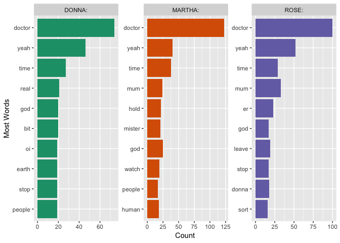
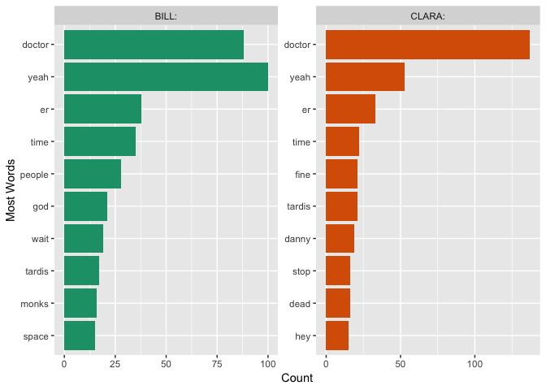

Doctor Who Analysis
================
Trent G.
3/22/2018

Doctor Who Text Analysis
------------------------

For my next project I wanted to perform a text analysis, and what could be better then analyzing my favorite tv show Doctor Who! Doctor Who is a sci-fi show that comes on BBC, it is also the longest running sci-fi. I highly recommend it if you have not already seen it.I would like to take a moment to say that as part of my analysis, I try to understand the characters motivation and might discuss their backstory or how they got to a certain point. With all that in mind, as the infamous Dr.River Song would say, "Spoilers." You have been warned!

Ok, let's get down to analyzing some data! To begin I created a function that webscrapes the desired lines for the desired doctor and then creates a dataframe with three columns: Value, speaker, dialogue. The value is the sem-processed script, where each speaker has their own row, the speaker is the one saying the text, and the dialogue is their text. The code for the function can be found in the webscraping\_function.R file. This function requires two arguments: the url where you are getting the specific script and then the doctor whose time period you are scraping. The doctor argument will be placed within the speaker column so make sure to enter your text as you would want to see it. As a warning, this function might take a few seconds to run.

Webscraping the Transcripts
===========================

``` r
#Get 11th Doctor's Lines
url <- "http://www.chakoteya.net/DoctorWho/episodes11.html"

eleventh <- webscrape_lines(url, "Eleventh:")

#Get 9th Doctor's Lines
url <- "http://www.chakoteya.net/DoctorWho/episodes9.html"

ninth <- webscrape_lines(url, "Ninth:")

#Get 10th Doctor's Lines
url <- "http://www.chakoteya.net/DoctorWho/episodes10.html"

tenth <- webscrape_lines(url, "Tenth:")

#Get 12th Doctor's Lines 
url <- "http://www.chakoteya.net/DoctorWho/episodes12.html"

twelveth <- webscrape_lines(url, "Twelveth:")
```

Ninth Doctor
============

Most words as said by the Ninth doctor.

``` r
ninth%>%
  filter(speaker == "Ninth:")%>%
  unnest_tokens(word, dialogue) %>%
  anti_join(stop_words)%>%
  count(word, sort = TRUE)%>%
  top_n(10)%>%
  mutate(word = reorder(word, n))%>%
  ggplot(aes(word,n))+geom_col(fill = "darkblue")+
  ggtitle("The Most Common Words Said By The Ninth Doctor")+
  ylab("Count")+
  xlab("The Doctor's Words")
```

    ## Joining, by = "word"

    ## Selecting by n


It is not surprising that Rose is up there, as well as time. Dead is an interesting one. This Doctor is still recovering from the time war and he often tells people that the time lords are dead/gone.

Let's take at look at the counts for Rose.

``` r
ninth%>%
  filter(speaker == "ROSE:"|
           speaker == "Ninth:")%>%
  unnest_tokens(word, dialogue) %>%
  anti_join(stop_words)%>%
  group_by(speaker)%>%
  count(word, sort = TRUE)%>%
  top_n(10)%>%
  ungroup()%>%
  mutate(word = reorder(word, n))%>%
   ggplot(aes(word,n,fill = speaker))+geom_col(show.legend = FALSE)+
  facet_wrap(~speaker, scales = "free_y")+
  labs(y = "Counts",
       x = "Words Said By Each Companion")+
  ggtitle("Top 10 Most Said Words for the Ninth Doctor and Rose")+
  coord_flip()
```

    ## Joining, by = "word"

    ## Selecting by n


To give some sort of comparison, I threw in the Ninth doctor. As we can see there are similarities, such as the words Dead and Bit. Like any good companion, Doctor is right up there as well as time. Now I would like to do a sentiment analysis to see who has more positive or negative words.

``` r
ninth%>%
  filter(speaker == "Ninth:"|
           speaker == "ROSE:")%>%
  unnest_tokens(word, dialogue) %>%
  anti_join(stop_words)%>%
  inner_join(get_sentiments("bing")) %>%
  group_by(speaker)%>%
  count(sentiment, sort = TRUE)%>%
  mutate(proportion = n/sum(n))%>%
  ungroup()%>%
  ggplot(aes(sentiment, proportion,fill = speaker))+geom_col(show.legend = FALSE)+
  facet_wrap(~speaker, scales = "free_y")+
  coord_flip()
```

    ## Joining, by = "word"
    ## Joining, by = "word"


Ok then, it seems that Rose is both a little more negative, and a little more positive in the words she says. The Ninth doctor is a little more brooding and withdrawn during this time of his life, while Rose is getting a chance to experience life and see new things, so this could explain why she may be more extreme in both directions.

Tenth Doctor
============

Alright, now time for the Tenth doctor and his companions.

``` r
tenth%>%
  filter(speaker == "Tenth:")%>%
  unnest_tokens(word, dialogue) %>%
  anti_join(stop_words)%>%
  count(word, sort = TRUE)%>%
  top_n(10)%>%
  mutate(word = reorder(word, n))%>%
  ggplot(aes(word,n))+geom_col(fill = "darkblue")+
  ggtitle("The Most Common Words Said By The Tenth Doctor")+
  ylab("Count")+
  xlab("The Doctor's Words")
```

    ## Joining, by = "word"

    ## Selecting by n


So this is interestig, Marth and Donna made the top 10 list, but Rose did not. It is possible that Martha and Donna had a little bit more screen time with appearing in odd episodes here and there. Another interesting note is how high up the word stop appears on the list. I would say that this is where the metaphorical wounds of the time war have done some healing, but the Tenth doctor still has some scars. Part of that healing process involves the Tenth doctor helping others and helping them to ammend their mistakes. The Tenth doctor thus has to say, "stop," to a cyberman take over or to a pointless civial war. Let's break the companion word count down to see how they look

``` r
tenth%>%
  filter(speaker == "ROSE:"|
    speaker == "MARTHA:"|
           speaker == "DONNA:")%>%
  unnest_tokens(word, dialogue) %>%
  anti_join(stop_words)%>%
  group_by(speaker)%>%
  count(word, sort = TRUE)%>%
  top_n(10)%>%
  ungroup()%>%
  mutate(word = reorder(word, n))%>%
   ggplot(aes(word,n,fill = speaker))+geom_col(show.legend = FALSE)+
  facet_wrap(~speaker, scales = "free_y")+
  labs(y = "Counts",
       x = "Words Said By Each Companion")+
  ggtitle("Top 10 Most Said Words for Rose, Martha, and Donna")+
  coord_flip()
```

    ## Joining, by = "word"

    ## Selecting by n



Ok very interesting! My first observations is how high up Doctor, yeah, and time are for all three companions. Next, it is intersting to see that both Marth and Rose have mum pretty high on the list, which makes sense since both characters are at a point in their lives where their moms are pretty invovled. Jackie is constantly worried what trouble her daughter is getting into with the Doctor, and Rose wanted to assure her that everything was fine. Martha on the other hand, although enjoyed her time with the Doctor, she had a life to get back to and kept thinking about her mom and the rest of her family. Donna, being an older companion, did not need a mother bear figure to watch over her and care for her. She had found a new life with the Tenth doctor, and hadn't even told her mother when she first started travling with him. One last thing I would like to point out is how high up the word real was on Donna's list. She has been whisked away from her temp work on this fantastic journey, there were many times in her adventures where she couldn't belive that her life had changed so much. Now, like before, let's do a sentiment analysis of these companions diaglogue.

``` r
tenth%>%
  filter(speaker == "ROSE:"|
           speaker == "MARTHA:"|
           speaker == "DONNA:")%>%
  unnest_tokens(word, dialogue) %>%
  anti_join(stop_words)%>%
  inner_join(get_sentiments("bing")) %>%
  group_by(speaker)%>%
  count(sentiment, sort = TRUE)%>%
  mutate(proportion = n/sum(n))%>%
  ungroup()%>%
  ggplot(aes(sentiment, proportion,fill = speaker))+geom_col(show.legend = FALSE)+
  facet_wrap(~speaker, scales = "free_y")+
  coord_flip()
```

    ## Joining, by = "word"
    ## Joining, by = "word"


Interesting, it seems that Donna had the greatest propotion of negative words, while Martha had the greatest proportion of positive words. Donna is by nature, no quite lamb, she is not afraid to put the Doctor or anyone else in their place, this could explain her having such a high proportion of negative words. Martha is brave young women for sure, and definately has to fight some pretty intense battles, but I would say out of the three companions, she has the best life situation, so it makes sense that the words she uses would be a little more positive. Alright on to the eleventh doctor!

Eleventh Doctor
===============

Alright, now it is time for the Eleventh doctor. I am curious to see if the words Geronimo, or bow tie appear on the list.

``` r
eleventh%>%
  filter(speaker == "Eleventh:")%>%
  unnest_tokens(word, dialogue) %>%
  anti_join(stop_words)%>%
  count(word, sort = TRUE)%>%
  top_n(10)%>%
  mutate(word = reorder(word, n))%>%
  ggplot(aes(word,n))+geom_col(fill = "darkblue")+
  ggtitle("The Most Common Words Said By The Eleventh Doctor")+
  ylab("Count")+
  xlab("The Doctor's Words")
```

    ## Joining, by = "word"

    ## Selecting by n

 I should have known that the eleventh doctor's most common word is "time." I also think it is pretty funny that of course the word "doctor" would be top five.

On to Rory, Amy, Clara, and River.

``` r
eleventh%>%
  filter(speaker == "AMY:"|
           speaker == "RORY:"|
           speaker == "CLARA:"|
           speaker == "RIVER:")%>%
  unnest_tokens(word, dialogue) %>%
  anti_join(stop_words)%>%
  group_by(speaker)%>%
  count(word, sort = TRUE)%>%
  top_n(10)%>%
  ungroup()%>%
  mutate(word = reorder(word, n))%>%
   ggplot(aes(word,n,fill = speaker))+geom_col(show.legend = FALSE)+
  facet_wrap(~speaker, scales = "free_y")+
  labs(y = "Counts",
       x = "Words Said By Each Companion")+
  ggtitle("Top 10 Most Said Words for Amy, Rory, River and Clara")+
  coord_flip()
```

    ## Joining, by = "word"

    ## Selecting by n

 Alright, very intersting. Not surprising that one of the most common words for all four companions is "doctor." Being a show about time travel, also not surprising that all of the companions talk about "time" as well. For Rory, Amy, and River it is interesting that some of their top common words would be each other, not surprising since they are the Ponds. River and Clara definately have more negative top words, though this would have to be examined more in depth with a sentiment analysis.

``` r
eleventh%>%
  filter(speaker == "AMY:"|
           speaker == "RORY:"|
           speaker == "CLARA:"|
           speaker == "RIVER:")%>%
  unnest_tokens(word, dialogue) %>%
  anti_join(stop_words)%>%
  inner_join(get_sentiments("bing")) %>%
  group_by(speaker)%>%
  count(sentiment, sort = TRUE)%>%
  mutate(proportion = n/sum(n))%>%
  ungroup()%>%
  ggplot(aes(sentiment, proportion,fill = speaker))+geom_col(show.legend = FALSE)+
  facet_wrap(~speaker, scales = "free_y")+
  coord_flip()
```

    ## Joining, by = "word"
    ## Joining, by = "word"

 Ok if I look at the proportion of positive and negative words over total words each companion saids, I was only half right. Clara had some pretty negative things to say, but so did Amy. Since running with the Doctor puts one in all sorts of danger, it is no surprise that each companion would have such high proportions of negative words. It is hard to say positive things when you might die at any moment. On to our last Doctor for this analysis, number Twelve!

Twelveth Doctor
===============

``` r
twelveth%>%
  filter(speaker == "Twelveth:")%>%
  unnest_tokens(word, dialogue) %>%
  anti_join(stop_words)%>%
  count(word, sort = TRUE)%>%
  top_n(10)%>%
  mutate(word = reorder(word, n))%>%
  ggplot(aes(word,n))+geom_col(fill = "darkblue")+
  ggtitle("The Most Common Words Said By The Twelveth Doctor")+
  ylab("Count")+
  xlab("The Doctor's Words")
```

    ## Joining, by = "word"

    ## Selecting by n


Alright, for this doctor had to modify things ever so slightly. It seems the links to each episode were stored a little differently than the other doctors and I had to change my webscraping function to accomadate this.

We see, like before, that time and the current companions for this doctor are pretty high on the list. Some notable differences would be the last word, er, it seems this is the only doctor with er on the list. Most likely this is due to the fact that the Twelveth doctor does not always care for nor undestand the social protocol of the situation and can be a little lost when someone needs a little emotional support.

``` r
twelveth%>%
  filter(speaker == "BILL:"|
           speaker == "CLARA:")%>%
  unnest_tokens(word, dialogue) %>%
  anti_join(stop_words)%>%
  group_by(speaker)%>%
  count(word, sort = TRUE)%>%
  top_n(10)%>%
  ungroup()%>%
  mutate(word = reorder(word, n))%>%
   ggplot(aes(word,n,fill = speaker))+geom_col(show.legend = FALSE)+
  facet_wrap(~speaker, scales = "free_y")+
  labs(y = "Counts",
       x = "Words Said By Each Companion")+
  ggtitle("Top 10 Most Said Words for Rose, Martha, and Donna")+
  coord_flip()
```

    ## Joining, by = "word"

    ## Selecting by n

 Looking at Bill and Clara, it is amazing how similar they are especially in their top 4. It is interesting to see how monks is one of Bill's top 10, but it would make sense since she was only on for one season and The Monks were an adversary that took up 3 whole episodes.
