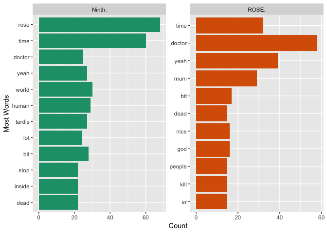
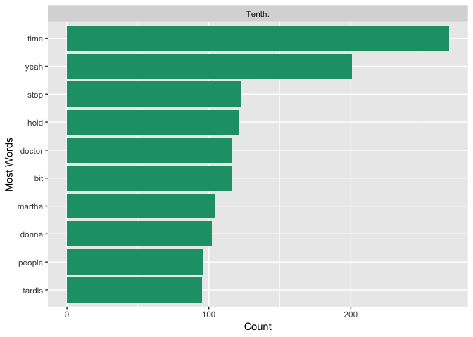
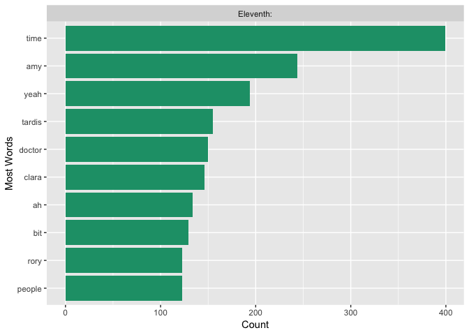

Doctor Who Analysis
================
Trent G.
3/22/2018

Doctor Who Text Analysis
------------------------

For my next project I wanted to perform a text analysis, and what could be better then analyzing my favorite tv show Doctor Who! Doctor Who is a sci-fi show that comes on BBC, it is also currently the longest running sci-fi. I highly recommend it if you have not already seen it.I would like to take a moment to say that as part of my analysis, I try to understand the characters motivation and might discuss their backstory or how they got to a certain point. With all that in mind, as the infamous Dr.River Song would say, "Spoilers." You have been warned!

Ok let's get down to analyzing some data! To begin I created a function that webscrapes the desired lines for the desired doctor and then creates a dataframe with three columns: Value, speaker, dialogue. The value is the sem-processed script, where each speaker has their own row, the speaker is the one saying the text, and the dialogue is their text. The code for the function can be found in the webscraping\_function.R file. This function requires two arguments: the url where you are getting the specific script and then the doctor whose time period you are scraping. The doctor argument will be placed within the speark column so make sure to enter your text as you would want to see it. As a warning this function might take a few seconds to run.

Webscraping the Transcripts
===========================

``` r
#Get 10th Doctor's Lines
url <- "http://www.chakoteya.net/DoctorWho/episodes11.html"

eleventh <- webscrape_lines(url, "Eleventh:")
```

    ## # A tibble: 193 x 1
    ##    value                                                                  
    ##    <chr>                                                                  
    ##  1 " [Tardis]\r\n"                                                        
    ##  2 [Tardis]                                                               
    ##  3 " (The Tardis is tumbling out of control and going\r\nBang! inside. It…
    ##  4 "[Bedroom]\r\n"                                                        
    ##  5 [Bedroom]                                                              
    ##  6 "(Night time. A pinwheel rattles in the overgrown\r\ngarden of an old …
    ##  7 ""                                                                     
    ##  8 "[Garden]\r\n"                                                         
    ##  9 [Garden]                                                               
    ## 10 "(For only the second time ever, the Tardis doors\r\nopen outwards - t…
    ## # ... with 183 more rows
    ## # A tibble: 106 x 1
    ##    value                                                                  
    ##    <chr>                                                                  
    ##  1 " [Class\r\nroom] "                                                    
    ##  2 "[Class\r\nroom]"                                                      
    ##  3 " (A city is flying through space, stuck on the back\r\nof a giant she…
    ##  4 ""                                                                     
    ##  5 "[By the lift]\r\n"                                                    
    ##  6 [By the lift]                                                          
    ##  7 "MANDY: You got a zero, didn't you? \r\nTIMMY: Yeah? So? \r\nMANDY: Yo…
    ##  8 ""                                                                     
    ##  9 "[Lift]\r\n"                                                           
    ## 10 [Lift]                                                                 
    ## # ... with 96 more rows
    ## # A tibble: 252 x 1
    ##    value                                                                  
    ##    <chr>                                                                  
    ##  1 " [Map\nroom] "                                                        
    ##  2 "[Map\nroom]"                                                          
    ##  3 " (In the War Rooms beneath Whitehall, an air raid\nsiren is wailing. …
    ##  4 ""                                                                     
    ##  5 "[Filing room]\n"                                                      
    ##  6 [Filing room]                                                          
    ##  7 "(The Tardis materialises in a filing room. A buzzer\nsounds in Church…
    ##  8 ""                                                                     
    ##  9 "[Corridor]\n"                                                         
    ## 10 [Corridor]                                                             
    ## # ... with 242 more rows
    ## # A tibble: 225 x 1
    ##    value                                                                  
    ##    <chr>                                                                  
    ##  1 " [Field]\r\n"                                                         
    ##  2 [Field]                                                                
    ##  3 " (A man in a uniform is standing in the middle of a\r\nfield, with a …
    ##  4 ""                                                                     
    ##  5 "[Corridor]\r\n"                                                       
    ##  6 [Corridor]                                                             
    ##  7 "ALISTAIR: Hallucinogenic lipstick. She's here. \r\n(A woman strides a…
    ##  8 ""                                                                     
    ##  9 "[Museum]\r\n"                                                         
    ## 10 [Museum]                                                               
    ## # ... with 215 more rows
    ## # A tibble: 181 x 1
    ##    value                                                                  
    ##    <chr>                                                                  
    ##  1 " [Tunnel]\r\n"                                                        
    ##  2 [Tunnel]                                                               
    ##  3 "DOCTOR: Up. Look up. \r\n(Everyone struggles to their feet on an arti…
    ##  4 ""                                                                     
    ##  5 "[Corridor]\r\n"                                                       
    ##  6 [Corridor]                                                             
    ##  7 "OCTAVIAN [OC]: Okay, men. Go, go, go! \r\n(The Doctor works on a cont…
    ##  8 ""                                                                     
    ##  9 "[Secondary Flight Deck]\r\n"                                          
    ## 10 [Secondary Flight Deck]                                                
    ## # ... with 171 more rows
    ## # A tibble: 213 x 1
    ##    value                                                                  
    ##    <chr>                                                                  
    ##  1 " [Throne\r\nroom] "                                                   
    ##  2 "[Throne\r\nroom]"                                                     
    ##  3 " (Venice, 1580. In a large, otherwise empty\r\nchamber, a woman sits …
    ##  4 ""                                                                     
    ##  5 "[Pub] "                                                               
    ##  6 [Pub]                                                                  
    ##  7 "(Rory is on the phone, trying to make himself heard\r\nabove the nois…
    ##  8 ""                                                                     
    ##  9 "[Amy's bedroom]\r\n"                                                  
    ## 10 [Amy's bedroom]                                                        
    ## # ... with 203 more rows
    ## # A tibble: 124 x 1
    ##    value                                                                  
    ##    <chr>                                                                  
    ##  1 " [Kitchen]\r\n"                                                       
    ##  2 [Kitchen]                                                              
    ##  3 " (In the quiet countryside, a cockerel crows. A\r\nvery heavily pregn…
    ##  4 ""                                                                     
    ##  5 "[Outside the house]\r\n"                                              
    ##  6 [Outside the house]                                                    
    ##  7 "(Long haired Rory returns home on his bicycle.) \r\nAMY [OC]: Rory, i…
    ##  8 ""                                                                     
    ##  9 "[Kitchen]\r\n"                                                        
    ## 10 [Kitchen]                                                              
    ## # ... with 114 more rows
    ## # A tibble: 184 x 1
    ##    value                                                                  
    ##    <chr>                                                                  
    ##  1 " [Cwmtaff]\r\n"                                                       
    ##  2 [Cwmtaff]                                                              
    ##  3 " (South Wales, 2020. An old mining village with\r\nhalf the homes boa…
    ##  4 ""                                                                     
    ##  5 "[Control room]\r\n"                                                   
    ##  6 [Control room]                                                         
    ##  7 "COMPUTER: Approaching stage four target drilling\r\ndepth. Stage four…
    ##  8 ""                                                                     
    ##  9 "[Store room]\r\n"                                                     
    ## 10 [Store room]                                                           
    ## # ... with 174 more rows
    ## # A tibble: 199 x 1
    ##    value                                                                  
    ##    <chr>                                                                  
    ##  1 "ELDANE\r\n[OC]: This is the story of our planet, Earth. Of the day a …
    ##  2 "[City]\r\n"                                                           
    ##  3 [City]                                                                 
    ##  4 "DOCTOR: This place is enormous and deserted. The\r\nmajority of the r…
    ##  5 ""                                                                     
    ##  6 "[Laboratory]\r\n"                                                     
    ##  7 [Laboratory]                                                           
    ##  8 "AMY: Don't you come near me with that. \r\n(The scientist makes an au…
    ##  9 ""                                                                     
    ## 10 "[Tunnel]\r\n"                                                         
    ## # ... with 189 more rows
    ## # A tibble: 144 x 1
    ##    value                                                                  
    ##    <chr>                                                                  
    ##  1 "\r\n(Autumn. Something cuts a swathe through the ripe wheat, scaring …
    ##  2 " [Museé d'Orsay]\r\n"                                                 
    ##  3 [Museé d'Orsay]                                                        
    ##  4 "(Wheatfield with crows is now hanging on a gallery\r\nwall with an ex…
    ##  5 ""                                                                     
    ##  6 "[Alleyway]\r\n"                                                       
    ##  7 [Alleyway]                                                             
    ##  8 "(Night. The Tardis materialises in a narrow alley,\r\nscaring a cat.)…
    ##  9 ""                                                                     
    ## 10 "[Outside the cafe]\r\n"                                               
    ## # ... with 134 more rows
    ## # A tibble: 515 x 1
    ##    value                                                                  
    ##    <chr>                                                                  
    ##  1 " [Aickman\r\nRoad] "                                                  
    ##  2 "[Aickman\r\nRoad]"                                                    
    ##  3 " (The Tardis materialises in a small park across\r\nthe road from gro…
    ##  4 ""                                                                     
    ##  5 "[Tardis]\r\n"                                                         
    ##  6 [Tardis]                                                               
    ##  7 "(The Tardis is shaking, and there is a shower of\r\nsparks nearby.) \…
    ##  8 ""                                                                     
    ##  9 "[Aickman Road]\r\n"                                                   
    ## 10 [Aickman Road]                                                         
    ## # ... with 505 more rows
    ## # A tibble: 271 x 1
    ##    value                                                                  
    ##    <chr>                                                                  
    ##  1 " [France\r\n1890] "                                                   
    ##  2 "[France\r\n1890]"                                                     
    ##  3 " (Night. It is raining. In a bedroom, an\r\nunappreciated artist is h…
    ##  4 ""                                                                     
    ##  5 "[Cabinet War Rooms, London 1941]\r\n"                                 
    ##  6 [Cabinet War Rooms, London 1941]                                       
    ##  7 "(Bracewell brings the picture to the Prime\r\nMinister.) \r\nBRACEWEL…
    ##  8 ""                                                                     
    ##  9 "[Stormcage Containment Facility 5145]\r\n"                            
    ## 10 [Stormcage Containment Facility 5145]                                  
    ## # ... with 261 more rows
    ## # A tibble: 166 x 1
    ##    value                                                                  
    ##    <chr>                                                                  
    ##  1 " [Amy's\r\nbedroom] "                                                 
    ##  2 "[Amy's\r\nbedroom]"                                                   
    ##  3 " (1,894 years later... and one star at least is\r\nstill burning brig…
    ##  4 ""                                                                     
    ##  5 "[Living room]\r\n"                                                    
    ##  6 [Living room]                                                          
    ##  7 "(The nice lady psychiatrist is looking at a\r\npainting of the moon a…
    ##  8 ""                                                                     
    ##  9 "[Outside the house]\r\n"                                              
    ## 10 [Outside the house]                                                    
    ## # ... with 156 more rows
    ## # A tibble: 340 x 1
    ##    value                                                                  
    ##    <chr>                                                                  
    ##  1 " [Starliner]\r\n"                                                     
    ##  2 [Starliner]                                                            
    ##  3 " (Near a planet with a thick cloudy atmosphere and\r\na lovely view o…
    ##  4 ""                                                                     
    ##  5 "[Main room]\r\n"                                                      
    ##  6 [Main room]                                                            
    ##  7 "(Down below the thick cloud layer is a bustling\r\nmetropolis, domina…
    ##  8 ""                                                                     
    ##  9 "[Starliner]\r\n"                                                      
    ## 10 [Starliner]                                                            
    ## # ... with 330 more rows
    ## # A tibble: 6 x 1
    ##   value                                                                   
    ##   <chr>                                                                   
    ## 1 "Part\r\nOne\r\n[Tardis]\r\n(The Doctor whistling whilst working undern…
    ## 2 "Part\r\nOne\r\n[Tardis]"                                               
    ## 3 "Part\r\nOne"                                                           
    ## 4 ""                                                                      
    ## 5 Part Two                                                                
    ## 6 ""                                                                      
    ## # A tibble: 166 x 1
    ##    value                                                                  
    ##    <chr>                                                                  
    ##  1 " In\r\nmemory of Elisabeth Sladen \r\n1948 - 2011 "                   
    ##  2 "In\r\nmemory of Elisabeth Sladen \r\n1948 - 2011"                     
    ##  3 ""                                                                     
    ##  4 " [Palace] "                                                           
    ##  5 [Palace]                                                               
    ##  6 " (The restored Monarch and his guards charge\r\nthrough the building.…
    ##  7 ""                                                                     
    ##  8 "[Kitchen]\r\n"                                                        
    ##  9 [Kitchen]                                                              
    ## 10 "(Amy is reading from a history book while Rory\r\nunpacks the shoppin…
    ## # ... with 156 more rows
    ## # A tibble: 181 x 1
    ##    value                                                                  
    ##    <chr>                                                                  
    ##  1 "[Valley\r\nof the Gods, Utah]\r\n"                                    
    ##  2 "[Valley\r\nof the Gods, Utah]"                                        
    ##  3 "(Three months later - July 1969. \r\nAmy is running for her life from…
    ##  4 ""                                                                     
    ##  5 "[Warehouse memory]\r\n"                                               
    ##  6 [Warehouse memory]                                                     
    ##  7 "(The Doctor is dragging Canton away.) \r\nDOCTOR: Canton. Amy. Amy! \…
    ##  8 ""                                                                     
    ##  9 "[Area 51, Nevada]\r\n"                                                
    ## 10 [Area 51, Nevada]                                                      
    ## # ... with 171 more rows
    ## # A tibble: 132 x 1
    ##    value                                                                  
    ##    <chr>                                                                  
    ##  1 " [On\r\ndeck] "                                                       
    ##  2 "[On\r\ndeck]"                                                         
    ##  3 " (A group of seventeenth century sailors row back\r\nto their ship, b…
    ##  4 ""                                                                     
    ##  5 "[Captain's cabin]\r\n"                                                
    ##  6 [Captain's cabin]                                                      
    ##  7 "(Lots of gold loot lying around.) \r\nBOATSWAIN: He slipped in the bi…
    ##  8 ""                                                                     
    ##  9 "[On deck]\r\n"                                                        
    ## 10 [On deck]                                                              
    ## # ... with 122 more rows
    ## # A tibble: 202 x 1
    ##    value                                                                  
    ##    <chr>                                                                  
    ##  1 " "                                                                    
    ##  2 " [Spaceship] "                                                        
    ##  3 [Spaceship]                                                            
    ##  4 " (A young woman is led in by an older woman. She\r\nspeaks to a man w…
    ##  5 ""                                                                     
    ##  6 "[Tardis]\r\n"                                                         
    ##  7 [Tardis]                                                               
    ##  8 "DOCTOR: And then we discovered it wasn't the Robot\r\nKing after all,…
    ##  9 ""                                                                     
    ## 10 "[Junkyard]\r\n"                                                       
    ## # ... with 192 more rows
    ## # A tibble: 167 x 1
    ##    value                                                                  
    ##    <chr>                                                                  
    ##  1 " [Corridor]\r\n"                                                      
    ##  2 [Corridor]                                                             
    ##  3 " (A monastery cum castle on an island. Think St\r\nMichael's Mount, b…
    ##  4 ""                                                                     
    ##  5 "[Acid room]\r\n"                                                      
    ##  6 [Acid room]                                                            
    ##  7 "JIMMY: Lights. You know the drill, people. Plastic\r\nvisors down and…
    ##  8 ""                                                                     
    ##  9 "[Corridor]\r\n"                                                       
    ## 10 [Corridor]                                                             
    ## # ... with 157 more rows
    ## # A tibble: 212 x 1
    ##    value                                                                  
    ##    <chr>                                                                  
    ##  1 " [Chapel]\r\n"                                                        
    ##  2 [Chapel]                                                               
    ##  3 " (The new Doctor is suffering.) \r\nG-DOCTOR: Argh. What's happening?…
    ##  4 ""                                                                     
    ##  5 "[Monastery]\r\n"                                                      
    ##  6 [Monastery]                                                            
    ##  7 "G-JENNIFER: Stop. Stop. Stop, stop. \r\n(Rory watches her go.) "      
    ##  8 ""                                                                     
    ##  9 "[Corridor]\r\n"                                                       
    ## 10 [Corridor]                                                             
    ## # ... with 202 more rows
    ## # A tibble: 177 x 1
    ##    value                                                                  
    ##    <chr>                                                                  
    ##  1 "[White\r\nroom]\r\n"                                                  
    ##  2 "[White\r\nroom]"                                                      
    ##  3 "(On Demon's Run, an asteroid modified into a\r\nhabitation, a baby ha…
    ##  4 ""                                                                     
    ##  5 "[Cyberspaceship]\r\n"                                                 
    ##  6 [Cyberspaceship]                                                       
    ##  7 "(Twenty thousand light years away, non-Cybus\r\nIndustries logoed but…
    ##  8 ""                                                                     
    ##  9 "[White room]\r\n"                                                     
    ## 10 [White room]                                                           
    ## # ... with 167 more rows
    ## # A tibble: 333 x 1
    ##    value                                                                  
    ##    <chr>                                                                  
    ##  1 " [Car]\r\n"                                                           
    ##  2 [Car]                                                                  
    ##  3 " (Rory is driving through a corn field very fast.\r\nAmy is navigatin…
    ##  4 ""                                                                     
    ##  5 "[Amy's bedroom]\r\n"                                                  
    ##  6 [Amy's bedroom]                                                        
    ##  7 "(Back when they were children. Amelia is getting\r\nher Doctor toys o…
    ##  8 ""                                                                     
    ##  9 "[Classroom]\r\n"                                                      
    ## 10 [Classroom]                                                            
    ## # ... with 323 more rows
    ## # A tibble: 206 x 1
    ##    value                                                                  
    ##    <chr>                                                                  
    ##  1 " [George's\r\nbedroom] "                                              
    ##  2 "[George's\r\nbedroom]"                                                
    ##  3 " (Night time at a large block of flats. The\r\nresidents are making t…
    ##  4 ""                                                                     
    ##  5 "[Living room]\r\n"                                                    
    ##  6 [Living room]                                                          
    ##  7 "ALEX: How is he? \r\nCLAIRE: He's in bed at least. \r\n(George uses a…
    ##  8 ""                                                                     
    ##  9 "[Tardis]\r\n"                                                         
    ## 10 [Tardis]                                                               
    ## # ... with 196 more rows
    ## # A tibble: 641 x 1
    ##    value                                                                  
    ##    <chr>                                                                  
    ##  1 " [Tardis]\r\n"                                                        
    ##  2 [Tardis]                                                               
    ##  3 "DOCTOR: Apalapucia. \r\nAMY: Say it again? \r\nDOCTOR: Apalapucia. \r…
    ##  4 ""                                                                     
    ##  5 "[White space]\r\n"                                                    
    ##  6 [White space]                                                          
    ##  7 "DOCTOR: Doors. Yes. I give you doors. But on the\r\nother side of tho…
    ##  8 ""                                                                     
    ##  9 "[Green Anchor room]\r\n"                                              
    ## 10 [Green Anchor room]                                                    
    ## # ... with 631 more rows
    ## # A tibble: 162 x 1
    ##    value                                                                  
    ##    <chr>                                                                  
    ##  1 " [Hotel]\r\n"                                                         
    ##  2 [Hotel]                                                                
    ##  3 " (A lone policewoman walks the corridors of a\r\ndeserted hotel, then…
    ##  4 ""                                                                     
    ##  5 "[Staircase]\r\n"                                                      
    ##  6 [Staircase]                                                            
    ##  7 "(Of the same hotel. The Tardis has parked herself\r\non the first flo…
    ##  8 ""                                                                     
    ##  9 "[Reception]\r\n"                                                      
    ## 10 [Reception]                                                            
    ## # ... with 152 more rows
    ## # A tibble: 232 x 1
    ##    value                                                                  
    ##    <chr>                                                                  
    ##  1 " [Ladies\r\nclothing] "                                               
    ##  2 "[Ladies\r\nclothing]"                                                 
    ##  3 " (Evening. The Sanderson & Grainger\r\ndepartment store sign and the …
    ##  4 ""                                                                     
    ##  5 "[Craig's home]\r\n"                                                   
    ##  6 [Craig's home]                                                         
    ##  7 "SOPHIE: There's a list on the fridge. \r\nCRAIG: I saw it. \r\nSOPHIE…
    ##  8 ""                                                                     
    ##  9 "[Changing rooms]\r\n"                                                 
    ## 10 [Changing rooms]                                                       
    ## # ... with 222 more rows
    ## # A tibble: 125 x 1
    ##    value                                                                  
    ##    <chr>                                                                  
    ##  1 " [London\r\n5:02pm 22nd April, 2011] "                                
    ##  2 "[London\r\n5:02pm 22nd April, 2011]"                                  
    ##  3 " (Not the London we know though, with steam trains\r\nrunning on aeri…
    ##  4 ""                                                                     
    ##  5 "[Churchill's office]\r\n"                                             
    ##  6 [Churchill's office]                                                   
    ##  7 "(Winston Churchill is having his blood pressure\r\nchecked by his Sil…
    ##  8 ""                                                                     
    ##  9 "[Disabled spaceship]\r\n"                                             
    ## 10 [Disabled spaceship]                                                   
    ## # ... with 115 more rows
    ## # A tibble: 226 x 1
    ##    value                                                                  
    ##    <chr>                                                                  
    ##  1 " \r\n[Prequel] "                                                      
    ##  2 "\r\n[Prequel] "                                                       
    ##  3 [Prequel]                                                              
    ##  4 " (On a spaceship, the Doctor is making a\r\nphone call to the Tardis.…
    ##  5 " (On a spaceship, the Doctor is making a\r\nphone call to the Tardis.…
    ##  6 ""                                                                     
    ##  7 " [Earth orbit] "                                                      
    ##  8 [Earth orbit]                                                          
    ##  9 " (Cannons of mass destruction protrude from the\r\nflanks of an impos…
    ## 10 ""                                                                     
    ## # ... with 216 more rows
    ## # A tibble: 20 x 1
    ##    value                                                                  
    ##    <chr>                                                                  
    ##  1 "April\r\n"                                                            
    ##  2 April                                                                  
    ##  3 "(The Doctor is leaving a message on the Williams'\r\nor Pond's answer…
    ##  4 ""                                                                     
    ##  5 "May\r\n"                                                              
    ##  6 May                                                                    
    ##  7 "(The Doctor bursts into Amy and Rory's bedroom.) \r\nDOCTOR: Argh! St…
    ##  8 ""                                                                     
    ##  9 "June\r\n"                                                             
    ## 10 June                                                                   
    ## 11 "(Morning. Rory is fastening his dressing gown and\r\nheading for the …
    ## 12 ""                                                                     
    ## 13 "July\r\n"                                                             
    ## 14 July                                                                   
    ## 15 "(In the Tardis, under the time console, the Doctor\r\nis on the phone…
    ## 16 ""                                                                     
    ## 17 "August\r\n"                                                           
    ## 18 August                                                                 
    ## 19 "(The Doctor is changing the bulb on the top of the\r\nTardis whilst l…
    ## 20 ""                                                                     
    ## # A tibble: 497 x 1
    ##    value                                                                  
    ##    <chr>                                                                  
    ##  1 " [Prequel]\r\n"                                                       
    ##  2 "[Prequel]\r\n"                                                        
    ##  3 [Prequel]                                                              
    ##  4 "(The Doctor is enjoying tea and a biscuit\r\nin a tea room when he se…
    ##  5 "(The Doctor is enjoying tea and a biscuit\r\nin a tea room when he se…
    ##  6 ""                                                                     
    ##  7 " [Skaro] "                                                            
    ##  8 [Skaro]                                                                
    ##  9 " (A scene of utter devastation and persisting\r\nrainfall. We pan aro…
    ## 10 ""                                                                     
    ## # ... with 487 more rows
    ## # A tibble: 170 x 1
    ##    value                                                                  
    ##    <chr>                                                                  
    ##  1 " [Egypt,\r\n1334 B.C.] "                                              
    ##  2 "[Egypt,\r\n1334 B.C.]"                                                
    ##  3 " (The Doctor rushes to the Tardis.) \r\nDOCTOR: Bye, then. Lovely mee…
    ##  4 ""                                                                     
    ##  5 " [Indian Space Agency 2367 A.D.]\r\n"                                 
    ##  6 [Indian Space Agency 2367 A.D.]                                        
    ##  7 " INDIRA: Craft size approximately ten million\r\nsquare kilometres. \…
    ##  8 ""                                                                     
    ##  9 " [African Plains 1902 A.D.] "                                         
    ## 10 [African Plains 1902 A.D.]                                             
    ## # ... with 160 more rows
    ## # A tibble: 192 x 1
    ##    value                                                                  
    ##    <chr>                                                                  
    ##  1 "WOMAN\r\n[OC]: When I was a child, my favourite story was about a man…
    ##  2 "[Desert]\r\n"                                                         
    ##  3 [Desert]                                                               
    ##  4 "(Night. A small satellite arrives, and its observer\r\ngets the instr…
    ##  5 ""                                                                     
    ##  6 "[Mercy]\r\n"                                                          
    ##  7 [Mercy]                                                                
    ##  8 "(The Old West of the USA. The Doctor stands just\r\noutside the entra…
    ##  9 ""                                                                     
    ## 10 "[Saloon]\r\n"                                                         
    ## # ... with 182 more rows
    ## # A tibble: 192 x 1
    ##    value                                                                  
    ##    <chr>                                                                  
    ##  1 "AMY\r\n[OC]: Life with the Doctor was like this. \r\n(Lots of flashes…
    ##  2 ""                                                                     
    ##  3 "[Kitchen - July]\r\n"                                                 
    ##  4 [Kitchen - July]                                                       
    ##  5 "(There are 59 messages on the telephone\r\nanswerphone. Rory it putti…
    ##  6 ""                                                                     
    ##  7 "[Back garden]\r\n"                                                    
    ##  8 [Back garden]                                                          
    ##  9 "RORY: We have two lives. Real life and Doctor life.\r\nExcept real li…
    ## 10 ""                                                                     
    ## # ... with 182 more rows
    ## # A tibble: 187 x 1
    ##    value                                                                  
    ##    <chr>                                                                  
    ##  1 " (Over\r\nthe view of someone using a proper old-fashioned manual typ…
    ##  2 ""                                                                     
    ##  3 "[Grayle's study]\r\n"                                                 
    ##  4 [Grayle's study]                                                       
    ##  5 "(On the ground floor of a rich man's home.) \r\nGRAYLE: So, will you …
    ##  6 ""                                                                     
    ##  7 "[Winter Quay apartments]\r\n"                                         
    ##  8 [Winter Quay apartments]                                               
    ##  9 "(The building is smothered in statuary, including a\r\nWeeping Angel.…
    ## 10 ""                                                                     
    ## # ... with 177 more rows
    ## # A tibble: 4 x 1
    ##   value                                                                   
    ##   <chr>                                                                   
    ## 1 "\r\n[London]\r\n"                                                      
    ## 2 "\r\n[London]"                                                          
    ## 3 "(Snowing.) \r\nNARRATOR [OC]: In London in the time of Queen Victoria,…
    ## 4 ""                                                                      
    ## # A tibble: 8 x 1
    ##   value                                                                   
    ##   <chr>                                                                   
    ## 1 "\r\n[Hallway]\r\n"                                                     
    ## 2 "\r\n[Hallway]"                                                         
    ## 3 "(Strax the Sontaran Butler is putting handcuffs on\r\na man.) \r\nSTRA…
    ## 4 ""                                                                      
    ## 5 "\r\n[Carriage]\r\n"                                                    
    ## 6 "\r\n[Carriage]"                                                        
    ## 7 "JENNY: Still no word from the Doctor, then? \r\nVASTRA: No, my dear. A…
    ## 8 ""                                                                      
    ## # A tibble: 197 x 1
    ##    value                                                                  
    ##    <chr>                                                                  
    ##  1 " (A\r\nshower of snowflakes with teeth heads towards Earth.) "        
    ##  2 " [Park] "                                                             
    ##  3 [Park]                                                                 
    ##  4 " (England, 1842. A large hedged area in a suburb,\r\nwith one big tre…
    ##  5 ""                                                                     
    ##  6 "[Institute]\r\n"                                                      
    ##  7 [Institute]                                                            
    ##  8 "(50 years later. The young boy is now a sour old\r\nman watching men …
    ##  9 ""                                                                     
    ## 10 "[Courtyard]\r\n"                                                      
    ## # ... with 187 more rows
    ## # A tibble: 4 x 1
    ##   value                                                                   
    ##   <chr>                                                                   
    ## 1 "[Demons\r\nRun]\r\n"                                                   
    ## 2 "[Demons\r\nRun]"                                                       
    ## 3 "JENNY: Strax. Strax. Strax. Strax. \r\nCOMPUTER: Warning. Evacuating. …
    ## 4 ""                                                                      
    ## # A tibble: 387 x 1
    ##    value                                                                  
    ##    <chr>                                                                  
    ##  1 "Prequel \r\n"                                                         
    ##  2 "Prequel \r\n"                                                         
    ##  3 Prequel                                                                
    ##  4 "[Playground]\r\n"                                                     
    ##  5 "[Playground]\r\n"                                                     
    ##  6 [Playground]                                                           
    ##  7 "GIRL: Hello. \r\nDOCTOR: Hello. \r\nGIRL: Why are you sitting on a sw…
    ##  8 "GIRL: Hello. \r\nDOCTOR: Hello. \r\nGIRL: Why are you sitting on a sw…
    ##  9 ""                                                                     
    ## 10 "(Over images of people connecting to a red wifi\r\nlinking the whole …
    ## # ... with 377 more rows
    ## # A tibble: 117 x 1
    ##    value                                                                  
    ##    <chr>                                                                  
    ##  1 " [Autumn\r\n1981] "                                                   
    ##  2 "[Autumn\r\n1981]"                                                     
    ##  3 " (A brisk breeze plays havoc with a young man's map\r\nas he walks do…
    ##  4 ""                                                                     
    ##  5 " [Playground] "                                                       
    ##  6 [Playground]                                                           
    ##  7 " DAVE: Give it a kick. \r\n(The little girl kicks a football which hi…
    ##  8 ""                                                                     
    ##  9 " [Cemetery] "                                                         
    ## 10 [Cemetery]                                                             
    ## # ... with 107 more rows
    ## # A tibble: 177 x 1
    ##    value                                                                  
    ##    <chr>                                                                  
    ##  1 " [Control\r\nroom] "                                                  
    ##  2 "[Control\r\nroom]"                                                    
    ##  3 " (Deep below the Northern Polar icepack in 1983, a\r\nRussian submari…
    ##  4 ""                                                                     
    ##  5 " [Storage] "                                                          
    ##  6 [Storage]                                                              
    ##  7 " (But in the compartment below them, the dirty ice\r\ncontains an chu…
    ##  8 ""                                                                     
    ##  9 " [Control room] "                                                     
    ## 10 [Control room]                                                         
    ## # ... with 167 more rows
    ## # A tibble: 179 x 1
    ##    value                                                                  
    ##    <chr>                                                                  
    ##  1 " [Caliburn\r\nHouse] "                                                
    ##  2 "[Caliburn\r\nHouse]"                                                  
    ##  3 " (It is a dark and stormy night. The paranormal\r\ninvestigators are …
    ##  4 ""                                                                     
    ##  5 " [Corridor] "                                                         
    ##  6 [Corridor]                                                             
    ##  7 " (The Doctor leads the way with a three pronged\r\ncandelabra.) \r\nP…
    ##  8 ""                                                                     
    ##  9 " [Living room] "                                                      
    ## 10 [Living room]                                                          
    ## # ... with 169 more rows
    ## # A tibble: 128 x 1
    ##    value                                                                  
    ##    <chr>                                                                  
    ##  1 " [Salvage\r\nship] "                                                  
    ##  2 "[Salvage\r\nship]"                                                    
    ##  3 " (Van Baalan Bros salvage ship A89//0989 is\r\npowering its way throu…
    ##  4 ""                                                                     
    ##  5 " [Tardis] "                                                           
    ##  6 [Tardis]                                                               
    ##  7 " DOCTOR: You said \r\nCLARA: I know what I said. I was the one who sa…
    ##  8 ""                                                                     
    ##  9 " [Salvage ship] "                                                     
    ## 10 [Salvage ship]                                                         
    ## # ... with 118 more rows
    ## # A tibble: 139 x 1
    ##    value                                                                  
    ##    <chr>                                                                  
    ##  1 " [Factory\r\ncorridor] "                                              
    ##  2 "[Factory\r\ncorridor]"                                                
    ##  3 " (Yorkshire 1893. In a small town perched on the\r\nside of a hill, w…
    ##  4 ""                                                                     
    ##  5 " [Morgue] "                                                           
    ##  6 [Morgue]                                                               
    ##  7 " (The attendant uncovers the corpse of Edmund. He\r\nis frozen mid-sc…
    ##  8 ""                                                                     
    ##  9 " [Conservatory] "                                                     
    ## 10 [Conservatory]                                                         
    ## # ... with 129 more rows
    ## # A tibble: 200 x 1
    ##    value                                                                  
    ##    <chr>                                                                  
    ##  1 " [Spacey\r\nZoomer] "                                                 
    ##  2 "[Spacey\r\nZoomer]"                                                   
    ##  3 " (The Tardis materialises in a exhibit which looks\r\nlike the moon's…
    ##  4 ""                                                                     
    ##  5 " [Webley's room] "                                                    
    ##  6 [Webley's room]                                                        
    ##  7 " (Down some steps into a comfortably furnished room\r\nwith lots of w…
    ##  8 ""                                                                     
    ##  9 " [Chess room] "                                                       
    ## 10 [Chess room]                                                           
    ## # ... with 190 more rows
    ## # A tibble: 115 x 1
    ##    value                                                                  
    ##    <chr>                                                                  
    ##  1 " \r\nShe Said, He Said - a prequel by Steven Moffat "                 
    ##  2 "\r\nShe Said, He Said - a prequel by Steven Moffat "                  
    ##  3 " CLARA: One day you meet the Doctor. And\r\nof course, it's the best …
    ##  4 " CLARA: One day you meet the Doctor. And\r\nof course, it's the best …
    ##  5 ""                                                                     
    ##  6 " [Citadel, Gallifrey] "                                               
    ##  7 [Citadel, Gallifrey]                                                   
    ##  8 " (A very long time ago, an alarm is sounding.) \r\nANDRO: Something w…
    ##  9 ""                                                                     
    ## 10 " [Repair shop] "                                                      
    ## # ... with 105 more rows
    ## # A tibble: 290 x 1
    ##    value                                                                  
    ##    <chr>                                                                  
    ##  1 "[Outside\r\nCoal Hill Secondary School]\r\n"                          
    ##  2 "[Outside\r\nCoal Hill Secondary School]"                              
    ##  3 "(A policeman is on his beat past the sign to I M\r\nForeman's scrap y…
    ##  4 ""                                                                     
    ##  5 "[Classroom]\r\n"                                                      
    ##  6 [Classroom]                                                            
    ##  7 "The end of class bell rings. A young man rushes in\r\nas the other st…
    ##  8 ""                                                                     
    ##  9 "[Tardis]\r\n"                                                         
    ## 10 [Tardis]                                                               
    ## # ... with 280 more rows
    ## # A tibble: 232 x 1
    ##    value                                                                  
    ##    <chr>                                                                  
    ##  1 "TASHA\r\n[OC]: Once, there was a planet, much like any other, and uni…
    ##  2 ""                                                                     
    ##  3 "[Spaceship]\r\n"                                                      
    ##  4 [Spaceship]                                                            
    ##  5 "(The Doctor beams in to a large dark space,\r\ncarrying a Dalek eye-s…
    ##  6 ""                                                                     
    ##  7 "[Tardis]\r\n"                                                         
    ##  8 [Tardis]                                                               
    ##  9 "DOCTOR: Every ship I go on, they just shoot at me.\r\nHandles, I said…
    ## 10 ""                                                                     
    ## # ... with 222 more rows

``` r
#Get 9th Doctor's Lines
url <- "http://www.chakoteya.net/DoctorWho/episodes9.html"

ninth <- webscrape_lines(url, "Ninth:")
```

    ## # A tibble: 137 x 1
    ##    value                                                                  
    ##    <chr>                                                                  
    ##  1 " [The\nTyler's flat] "                                                
    ##  2 "[The\nTyler's flat]"                                                  
    ##  3 "(Earth, United\nKingdom, South London. An alarm clock goes off at 7:3…
    ##  4 ""                                                                     
    ##  5 "\n[Henricks Department Store] "                                       
    ##  6 "\n[Henricks Department Store]"                                        
    ##  7 "(Rose takes the bus\nto Central London and gets off outside the depar…
    ##  8 ""                                                                     
    ##  9 "[Service lift]\n"                                                     
    ## 10 [Service lift]                                                         
    ## # ... with 127 more rows
    ## # A tibble: 219 x 1
    ##    value                                                                  
    ##    <chr>                                                                  
    ##  1 " [Tardis]\n"                                                          
    ##  2 [Tardis]                                                               
    ##  3 " (Carrying straight on from the last episode. The\nDoctor and Rose ar…
    ##  4 ""                                                                     
    ##  5 "[Gallery 15]\n"                                                       
    ##  6 [Gallery 15]                                                           
    ##  7 "(Rose goes down a flight of steps and a large\nshutter in the wall de…
    ##  8 ""                                                                     
    ##  9 "[Space]\n"                                                            
    ## 10 [Space]                                                                
    ## # ... with 209 more rows
    ## # A tibble: 154 x 1
    ##    value                                                                  
    ##    <chr>                                                                  
    ##  1 "[Chapel\nof Rest]\n"                                                  
    ##  2 "[Chapel\nof Rest]"                                                    
    ##  3 "(A small altar with a cross on it flanked by a pair\nof candles. The …
    ##  4 ""                                                                     
    ##  5 "[Tardis]\n"                                                           
    ##  6 [Tardis]                                                               
    ##  7 "(The Tardis is in a rather jerky flight.) \nDOCTOR: Hold that one dow…
    ##  8 ""                                                                     
    ##  9 "[Kitchen]\n"                                                          
    ## 10 [Kitchen]                                                              
    ## # ... with 144 more rows
    ## # A tibble: 214 x 1
    ##    value                                                                  
    ##    <chr>                                                                  
    ##  1 "[Powell Estate] "                                                     
    ##  2 "[Powell Estate] "                                                     
    ##  3 [Powell Estate]                                                        
    ##  4 "(The Tardis materialises. Rose and the Doctor get\nout.) \nROSE: How …
    ##  5 ""                                                                     
    ##  6 "[The Tyler's flat]\n"                                                 
    ##  7 [The Tyler's flat]                                                     
    ##  8 "ROSE: I'm back! I was with Shareen. She was all\nupset again. Are you…
    ##  9 ""                                                                     
    ## 10 "[Powell Estate]\n"                                                    
    ## # ... with 204 more rows
    ## # A tibble: 517 x 1
    ##    value                                                                  
    ##    <chr>                                                                  
    ##  1 " (Transcriber's\nnote - Cabinet scene extended from the version on my…
    ##  2 "(Transcriber's\nnote - Cabinet scene extended from the version on my …
    ##  3 "[Briefing room]\n"                                                    
    ##  4 [Briefing room]                                                        
    ##  5 "(The Doctor manages to rip off his ID card.) \nDOCTOR: Deadly to huma…
    ##  6 ""                                                                     
    ##  7 "[The Tyler's flat]\n"                                                 
    ##  8 [The Tyler's flat]                                                     
    ##  9 "(Mickey enters.) \nMICKEY: Jackie! \n(He smashes a chair across the b…
    ## 10 ""                                                                     
    ## # ... with 507 more rows
    ## # A tibble: 266 x 1
    ##    value                                                                  
    ##    <chr>                                                                  
    ##  1 "[Museum]\n"                                                           
    ##  2 [Museum]                                                               
    ##  3 " (The Tardis materialises in dimly lit area with\ncarpeting and displ…
    ##  4 ""                                                                     
    ##  5 "[Corridor]\n"                                                         
    ##  6 [Corridor]                                                             
    ##  7 "TANNOY: Attention all personnel. Bad Wolf One\ndescending. Bad Wolf O…
    ##  8 ""                                                                     
    ##  9 "[Cage]\n"                                                             
    ## 10 [Cage]                                                                 
    ## # ... with 256 more rows
    ## # A tibble: 182 x 1
    ##    value                                                                  
    ##    <chr>                                                                  
    ##  1 "[Observation\ndeck]\n"                                                
    ##  2 "[Observation\ndeck]"                                                  
    ##  3 "(A traffic report is on a public viewscreen.) \nWOMAN [OC]: Solar fla…
    ##  4 ""                                                                     
    ##  5 "[Floor 139]\n"                                                        
    ##  6 [Floor 139]                                                            
    ##  7 "(The space station has a central hub with three\nwheels turning.) \nD…
    ##  8 ""                                                                     
    ##  9 "[Floor 500]\n"                                                        
    ## 10 [Floor 500]                                                            
    ## # ... with 172 more rows
    ## # A tibble: 106 x 1
    ##    value                                                                  
    ##    <chr>                                                                  
    ##  1 "[Memory\n- Jackie's bedroom]\n"                                       
    ##  2 "[Memory\n- Jackie's bedroom]"                                         
    ##  3 "(A photograph of a laughing man with thinning\nhair.) \nROSE [OC]: Pe…
    ##  4 ""                                                                     
    ##  5 "[Tardis]\n"                                                           
    ##  6 [Tardis]                                                               
    ##  7 "ROSE: That's what Mum always says. So I was\nthinking, could we, coul…
    ##  8 ""                                                                     
    ##  9 "[Register office]\n"                                                  
    ## 10 [Register office]                                                      
    ## # ... with 96 more rows
    ## # A tibble: 155 x 1
    ##    value                                                                  
    ##    <chr>                                                                  
    ##  1 "[Tardis]\n"                                                           
    ##  2 [Tardis]                                                               
    ##  3 "(The Tardis is in pursuit of a small spacecraft.) \nROSE: What's the …
    ##  4 ""                                                                     
    ##  5 "[Alleyway]\n"                                                         
    ##  6 [Alleyway]                                                             
    ##  7 "(The Tardis materialises in a back alley between\ntwo terraces. The s…
    ##  8 ""                                                                     
    ##  9 "[Nightclub]\n"                                                        
    ## 10 [Nightclub]                                                            
    ## # ... with 145 more rows
    ## # A tibble: 144 x 1
    ##    value                                                                  
    ##    <chr>                                                                  
    ##  1 "[Albion\nhospital]\n"                                                 
    ##  2 "[Albion\nhospital]"                                                   
    ##  3 "(The patients are almost within touching distance.)\n\nDOCTOR: Go to …
    ##  4 ""                                                                     
    ##  5 "[The Lloyd's dining room]\n"                                          
    ##  6 [The Lloyd's dining room]                                              
    ##  7 "(From the window, Nancy watches the child walk away\ndown the street.…
    ##  8 ""                                                                     
    ##  9 "[Albion Hospital ward]\n"                                             
    ## 10 [Albion Hospital ward]                                                 
    ## # ... with 134 more rows
    ## # A tibble: 113 x 1
    ##    value                                                                  
    ##    <chr>                                                                  
    ##  1 "Previously\n- \n(The Slitheen spaceship crashes in the Thames.) \nMAR…
    ##  2 ""                                                                     
    ##  3 "[Lord Mayor's office]\n"                                              
    ##  4 [Lord Mayor's office]                                                  
    ##  5 "(Six months later, in a large executive office\nsuite.) \nCLEAVER: I'…
    ##  6 ""                                                                     
    ##  7 "[Roald Dahl Plass]\n"                                                 
    ##  8 [Roald Dahl Plass]                                                     
    ##  9 "(Mickey arrives at Cardiff Central railway station\nand heads to the …
    ## 10 ""                                                                     
    ## # ... with 103 more rows
    ## # A tibble: 233 x 1
    ##    value                                                                  
    ##    <chr>                                                                  
    ##  1 "[Big Brother House]\n"                                                
    ##  2 "[Big Brother House]\n"                                                
    ##  3 [Big Brother House]                                                    
    ##  4 "(100 years later than The Long Game. Transcriber's\nnote - never seen…
    ##  5 "Transcriber's\nnote - never seen the BB show, never want to, and I am…
    ##  6 "[Diary room]\n"                                                       
    ##  7 [Diary room]                                                           
    ##  8 "(The Doctor goes through a door with the stylised\neye on it and sits…
    ##  9 ""                                                                     
    ## 10 "[The Weakest Link]\n"                                                 
    ## # ... with 223 more rows
    ## # A tibble: 246 x 1
    ##    value                                                                  
    ##    <chr>                                                                  
    ##  1 "[Spaceship]\n"                                                        
    ##  2 [Spaceship]                                                            
    ##  3 "DALEK: You know the Doctor. You understand him. You\nwill predict his…
    ##  4 ""                                                                     
    ##  5 "[Tardis]\n"                                                           
    ##  6 [Tardis]                                                               
    ##  7 "JACK: We've got incoming! \n(The Dalek missiles strike the Tardis, an…
    ##  8 ""                                                                     
    ##  9 "[Spaceship]\n"                                                        
    ## 10 [Spaceship]                                                            
    ## # ... with 236 more rows

``` r
#Get 10th Doctor's Lines
url <- "http://www.chakoteya.net/DoctorWho/episodes10.html"

tenth <- webscrape_lines(url, "Tenth:")
```

    ## # A tibble: 6 x 1
    ##   value                                                                   
    ##   <chr>                                                                   
    ## 1 "Transcribed\r\nby Sarah Welch\r\n"                                     
    ## 2 "(Recap of the final scenes of 113 \"The Parting of\r\nthe Ways\".)\r\n"
    ## 3 "[TARDIS]\r\n"                                                          
    ## 4 [TARDIS]                                                                
    ## 5 "(The new Doctor dashes to the console and flicks a\r\nfew switches, ch…
    ## 6 ""                                                                      
    ## # A tibble: 230 x 1
    ##    value                                                                  
    ##    <chr>                                                                  
    ##  1 "[Clancy's\r\ngarage]\r\n"                                             
    ##  2 "[Clancy's\r\ngarage]"                                                 
    ##  3 "(In the Tyler's flat, Jackie is decorating the\r\nwhite plastic Chris…
    ##  4 ""                                                                     
    ##  5 "[The Tyler's flat]\r\n"                                               
    ##  6 [The Tyler's flat]                                                     
    ##  7 "(Jackie hears it too.) \r\nJACKIE: Rose! "                            
    ##  8 ""                                                                     
    ##  9 "[Powell Estate]\r\n"                                                  
    ## 10 [Powell Estate]                                                        
    ## # ... with 220 more rows
    ## # A tibble: 234 x 1
    ##    value                                                                  
    ##    <chr>                                                                  
    ##  1 "[Powell\r\nEstate]\r\n"                                               
    ##  2 "[Powell\r\nEstate]"                                                   
    ##  3 "(The Doctor is starting to power up the Tardis,\r\nwhile outside Jack…
    ##  4 ""                                                                     
    ##  5 "[Tardis]\r\n"                                                         
    ##  6 [Tardis]                                                               
    ##  7 "ROSE: So where are we going? \r\nDOCTOR: Further than we've ever gone…
    ##  8 ""                                                                     
    ##  9 "[New Earth]\r\n"                                                      
    ## 10 [New Earth]                                                            
    ## # ... with 224 more rows
    ## # A tibble: 179 x 1
    ##    value                                                                  
    ##    <chr>                                                                  
    ##  1 "[Courtyard]\n"                                                        
    ##  2 [Courtyard]                                                            
    ##  3 "(A group of cowled figures cross the windy moor\nwith their cart and …
    ##  4 ""                                                                     
    ##  5 "[Cellar]\n"                                                           
    ##  6 [Cellar]                                                               
    ##  7 "(The servants are chained up in a cellar, along\nwith their mistress.…
    ##  8 ""                                                                     
    ##  9 "[Tardis]\n"                                                           
    ## 10 [Tardis]                                                               
    ## # ... with 169 more rows
    ## # A tibble: 249 x 1
    ##    value                                                                  
    ##    <chr>                                                                  
    ##  1 "[Outside\r\nthe Headmaster's office]\r\n"                             
    ##  2 "[Outside\r\nthe Headmaster's office]"                                 
    ##  3 "(A man comes down the stairs of Deffry Vale High\r\nSchool and walks …
    ##  4 ""                                                                     
    ##  5 "[Physics laboratory]\r\n"                                             
    ##  6 [Physics laboratory]                                                   
    ##  7 "(Up on the first floor, there is a change of class.\r\nThe teacher en…
    ##  8 ""                                                                     
    ##  9 "[Canteen]\r\n"                                                        
    ## 10 [Canteen]                                                              
    ## # ... with 239 more rows
    ## # A tibble: 133 x 1
    ##    value                                                                  
    ##    <chr>                                                                  
    ##  1 "[Palace\r\nof Versailles]\r\n"                                        
    ##  2 "[Palace\r\nof Versailles]"                                            
    ##  3 "(18th Century France, and the guests at a masked\r\nball are running …
    ##  4 ""                                                                     
    ##  5 "[Spaceship]\r\n"                                                      
    ##  6 [Spaceship]                                                            
    ##  7 "(Three thousand years later, the Tardis\r\nmaterialises on a spaceshi…
    ##  8 ""                                                                     
    ##  9 "[Fireplace room]\r\n"                                                 
    ## 10 [Fireplace room]                                                       
    ## # ... with 123 more rows
    ## # A tibble: 205 x 1
    ##    value                                                                  
    ##    <chr>                                                                  
    ##  1 " [Laboratory]\r\n"                                                    
    ##  2 [Laboratory]                                                           
    ##  3 "(A man in a lab coat presses a button, and\r\nbacklights a humanoid f…
    ##  4 ""                                                                     
    ##  5 "[Tardis]\r\n"                                                         
    ##  6 [Tardis]                                                               
    ##  7 "DOCTOR: And that weird munchkin lady with the big\r\neyes? Do you rem…
    ##  8 ""                                                                     
    ##  9 "[Lambeth Pier]\r\n"                                                   
    ## 10 [Lambeth Pier]                                                         
    ## # ... with 195 more rows
    ## # A tibble: 205 x 1
    ##    value                                                                  
    ##    <chr>                                                                  
    ##  1 "[Outside\r\nthe Tyler's house]\r\n"                                   
    ##  2 "[Outside\r\nthe Tyler's house]"                                       
    ##  3 "(Carrying on from the end of the last episode -\r\nbecause I can't be…
    ##  4 ""                                                                     
    ##  5 "[Van]\r\n"                                                            
    ##  6 [Van]                                                                  
    ##  7 "RICKY: What was that thing? \r\nDOCTOR: Little bit of technology from…
    ##  8 ""                                                                     
    ##  9 "[Control room]\r\n"                                                   
    ## 10 [Control room]                                                         
    ## # ... with 195 more rows
    ## # A tibble: 182 x 1
    ##    value                                                                  
    ##    <chr>                                                                  
    ##  1 "[Magpie's\r\nElectricals]\r\n"                                        
    ##  2 "[Magpie's\r\nElectricals]"                                            
    ##  3 "(It is a stormy night. The sole proprietor of the\r\nshop on the corn…
    ##  4 ""                                                                     
    ##  5 "[Living room]\r\n"                                                    
    ##  6 [Living room]                                                          
    ##  7 "(The family are listening to the wireless. Mother\r\nis using a sewin…
    ##  8 ""                                                                     
    ##  9 "[Magpie's Electricals]\r\n"                                           
    ## 10 [Magpie's Electricals]                                                 
    ## # ... with 172 more rows
    ## # A tibble: 293 x 1
    ##    value                                                                  
    ##    <chr>                                                                  
    ##  1 "[Storage\r\narea 6]\r\n"                                              
    ##  2 "[Storage\r\narea 6]"                                                  
    ##  3 "(The Tardis materialises in a very tight space.) \r\nDOCTOR: I don't …
    ##  4 ""                                                                     
    ##  5 "[Junction]\r\n"                                                       
    ##  6 [Junction]                                                             
    ##  7 "COMPUTER: Open door 15. \r\nDOCTOR: Some sort of base. Moon base, sea…
    ##  8 ""                                                                     
    ##  9 "[Corridor]\r\n"                                                       
    ## 10 [Corridor]                                                             
    ## # ... with 283 more rows
    ## # A tibble: 631 x 1
    ##    value                                                                  
    ##    <chr>                                                                  
    ##  1 "[Drilling\r\narea]\r\n"                                               
    ##  2 "[Drilling\r\narea]"                                                   
    ##  3 "JEFFERSON: Open fire! \r\n(Jefferson and the guard start shooting at …
    ##  4 ""                                                                     
    ##  5 "[Control room]\r\n"                                                   
    ##  6 [Control room]                                                         
    ##  7 "ZACH: We're stabilising \r\n(The overhead shutters close.) \r\nZACH: …
    ##  8 ""                                                                     
    ##  9 "[Drilling area]\r\n"                                                  
    ## 10 [Drilling area]                                                        
    ## # ... with 621 more rows
    ## # A tibble: 116 x 1
    ##    value                                                                  
    ##    <chr>                                                                  
    ##  1 " [Waste\r\nground] "                                                  
    ##  2 "[Waste\r\nground]"                                                    
    ##  3 " (A young man is stumbling over broken bricks and\r\nrubble until he …
    ##  4 ""                                                                     
    ##  5 "[Warehouse]\r\n"                                                      
    ##  6 [Warehouse]                                                            
    ##  7 "DOCTOR [OC]: Where's he gone? Can you see him? \r\nROSE [OC]: There h…
    ##  8 ""                                                                     
    ##  9 "[Elton's bedsit]\r\n"                                                 
    ## 10 [Elton's bedsit]                                                       
    ## # ... with 106 more rows
    ## # A tibble: 188 x 1
    ##    value                                                                  
    ##    <chr>                                                                  
    ##  1 " "                                                                    
    ##  2 "[Dame Kelly Holmes Close]\r\n"                                        
    ##  3 [Dame Kelly Holmes Close]                                              
    ##  4 "(The bunting is out for the 2012 Olympics in the\r\nbrand new Stratfo…
    ##  5 ""                                                                     
    ##  6 "[Chloe's bedroom]\r\n"                                                
    ##  7 [Chloe's bedroom]                                                      
    ##  8 "CHLOE: (sings) Kookaburra sits in the old gum tree.\r\nMerry merry ki…
    ##  9 ""                                                                     
    ## 10 "[Dame Kelly Holmes Close]\r\n"                                        
    ## # ... with 178 more rows
    ## # A tibble: 207 x 1
    ##    value                                                                  
    ##    <chr>                                                                  
    ##  1 "ROSE\r\n[OC]: Planet Earth. This is where I was born. And this is whe…
    ##  2 ""                                                                     
    ##  3 "[Planet]\r\n"                                                         
    ##  4 [Planet]                                                               
    ##  5 "DOCTOR: How long are you going to stay with me? \r\nROSE: Forever. \r…
    ##  6 ""                                                                     
    ##  7 "[The Tyler's flat]\r\n"                                               
    ##  8 [The Tyler's flat]                                                     
    ##  9 "(The Tardis materialises in a corner of the\r\nchildren's playground …
    ## 10 ""                                                                     
    ## # ... with 197 more rows
    ## # A tibble: 301 x 1
    ##    value                                                                  
    ##    <chr>                                                                  
    ##  1 "[Sphere\r\nlaboratory]\r\n"                                           
    ##  2 "[Sphere\r\nlaboratory]"                                               
    ##  3 "(The Daleks have landed and are trundling across\r\nthe floor.) \r\nD…
    ##  4 ""                                                                     
    ##  5 "[Yvonne's office]\r\n"                                                
    ##  6 [Yvonne's office]                                                      
    ##  7 "JACKIE: What's down there? She was in that room\r\nwith the sphere. W…
    ##  8 ""                                                                     
    ##  9 "[Sphere laboratory]\r\n"                                              
    ## 10 [Sphere laboratory]                                                    
    ## # ... with 291 more rows
    ## # A tibble: 227 x 1
    ##    value                                                                  
    ##    <chr>                                                                  
    ##  1 "\r\n[St Mary's Church]\r\n"                                           
    ##  2 "\r\n[St Mary's Church]"                                               
    ##  3 "(The bride's father has his arm linked through hers\r\ninstead of the…
    ##  4 ""                                                                     
    ##  5 "[Tardis]\r\n"                                                         
    ##  6 [Tardis]                                                               
    ##  7 "(The golden energy flies into the Tardis and\r\nsolidifies back into …
    ##  8 ""                                                                     
    ##  9 "[St Mary's Church]\r\n"                                               
    ## 10 [St Mary's Church]                                                     
    ## # ... with 217 more rows
    ## # A tibble: 242 x 1
    ##    value                                                                  
    ##    <chr>                                                                  
    ##  1 " [Street]\r\n"                                                        
    ##  2 [Street]                                                               
    ##  3 " (A young black woman is walking down a busy London\r\nstreet, listen…
    ##  4 ""                                                                     
    ##  5 "[Jones' home]\r\n"                                                    
    ##  6 [Jones' home]                                                          
    ##  7 "(It is her sister.) \r\nTISH: It's a nightmare, because Dad won't lis…
    ##  8 ""                                                                     
    ##  9 "[Street]\r\n"                                                         
    ## 10 [Street]                                                               
    ## # ... with 232 more rows
    ## # A tibble: 143 x 1
    ##    value                                                                  
    ##    <chr>                                                                  
    ##  1 "\r\n[Balthazar's spaceship]\r\n"                                      
    ##  2 "\r\n[Balthazar's spaceship]"                                          
    ##  3 "(A cyborg alien is viewing Earth from his\r\nspaceship.) \r\nBALTAZAR…
    ##  4 ""                                                                     
    ##  5 "\r\n[Tardis]\r\n"                                                     
    ##  6 "\r\n[Tardis]"                                                         
    ##  7 "(In flight.) \r\nMARTHA: Will Baltazar ever get caught? \r\nDOCTOR: O…
    ##  8 ""                                                                     
    ##  9 "\r\n[Space]\r\n"                                                      
    ## 10 "\r\n[Space]"                                                          
    ## # ... with 133 more rows
    ## # A tibble: 185 x 1
    ##    value                                                                  
    ##    <chr>                                                                  
    ##  1 "[London\n1599]\n"                                                     
    ##  2 "[London\n1599]"                                                       
    ##  3 "(Evening. A young man playing a lute and serenading\na woman who is l…
    ##  4 ""                                                                     
    ##  5 "[Lilith's house]\n"                                                   
    ##  6 [Lilith's house]                                                       
    ##  7 "LILITH: Would you enter, bold sir? \nWIGGINS: Oh, I would. \n(The roo…
    ##  8 ""                                                                     
    ##  9 "[Tardis]\n"                                                           
    ## 10 [Tardis]                                                               
    ## # ... with 175 more rows
    ## # A tibble: 306 x 1
    ##    value                                                                  
    ##    <chr>                                                                  
    ##  1 " [Car\r\n10 hot 5] "                                                  
    ##  2 "[Car\r\n10 hot 5]"                                                    
    ##  3 " (A slightly static image of a woman is on the\r\nmonitor next to a l…
    ##  4 ""                                                                     
    ##  5 "[Tardis]\r\n"                                                         
    ##  6 [Tardis]                                                               
    ##  7 "DOCTOR: Just one trip. That's what I said. One trip\r\nin the Tardis,…
    ##  8 ""                                                                     
    ##  9 "[Pharmacy Town]\r\n"                                                  
    ## 10 [Pharmacy Town]                                                        
    ## # ... with 296 more rows
    ## # A tibble: 179 x 1
    ##    value                                                                  
    ##    <chr>                                                                  
    ##  1 "[Backstage]\r\n"                                                      
    ##  2 [Backstage]                                                            
    ##  3 "(The Laurenzi presents - New York Revue. The music\r\ntells me we're …
    ##  4 ""                                                                     
    ##  5 "[Tallulah's dressing room]\r\n"                                       
    ##  6 [Tallulah's dressing room]                                             
    ##  7 "(Tallulah's costume is white with wings and a halo.\r\nShe is kissing…
    ##  8 ""                                                                     
    ##  9 "[Backstage]\r\n"                                                      
    ## 10 [Backstage]                                                            
    ## # ... with 169 more rows
    ## # A tibble: 239 x 1
    ##    value                                                                  
    ##    <chr>                                                                  
    ##  1 "[Dalek\r\nlaboratory]\r\n"                                            
    ##  2 "[Dalek\r\nlaboratory]"                                                
    ##  3 "SEC: These humans will become like me. Prepare them\r\nfor hybridisat…
    ##  4 ""                                                                     
    ##  5 "[Sewers]\r\n"                                                         
    ##  6 [Sewers]                                                               
    ##  7 "DOCTOR: Come on! Move, move, move, move, move! \r\n(The Doctor leads …
    ##  8 ""                                                                     
    ##  9 "[Hooverville]\r\n"                                                    
    ## 10 [Hooverville]                                                          
    ## # ... with 229 more rows
    ## # A tibble: 173 x 1
    ##    value                                                                  
    ##    <chr>                                                                  
    ##  1 "[Tardis]\r\n"                                                         
    ##  2 [Tardis]                                                               
    ##  3 "(The Tardis lands, and the Doctor puts on the hand\r\nbrake.) \r\nDOC…
    ##  4 ""                                                                     
    ##  5 "[Martha's home]\r\n"                                                  
    ##  6 [Martha's home]                                                        
    ##  7 "(The Tardis is next to the clothes horse.) \r\nMARTHA: Home. You took…
    ##  8 ""                                                                     
    ##  9 "[Lazarus's office]\r\n"                                               
    ## 10 [Lazarus's office]                                                     
    ## # ... with 163 more rows
    ## # A tibble: 474 x 1
    ##    value                                                                  
    ##    <chr>                                                                  
    ##  1 "[Tardis]\r\n"                                                         
    ##  2 [Tardis]                                                               
    ##  3 "(The Doctor uses his sonic screwdriver on Martha's\r\nmobile phone.) …
    ##  4 ""                                                                     
    ##  5 "[Area 30]\r\n"                                                        
    ##  6 [Area 30]                                                              
    ##  7 "(Lots of steam and the place is glowing red.) \r\nCOMPUTER: Distress …
    ##  8 ""                                                                     
    ##  9 "[Area 29]\r\n"                                                        
    ## 10 [Area 29]                                                              
    ## # ... with 464 more rows
    ## # A tibble: 173 x 1
    ##    value                                                                  
    ##    <chr>                                                                  
    ##  1 "[Tardis]\r\n"                                                         
    ##  2 [Tardis]                                                               
    ##  3 "(The Doctor and Martha run into the Tardis, closely\r\nfollowed by a …
    ##  4 ""                                                                     
    ##  5 "[Doctor's room]\r\n"                                                  
    ##  6 [Doctor's room]                                                        
    ##  7 "(The Doctor is lying on a bed in an old-fashioned\r\nwood panelled ro…
    ##  8 ""                                                                     
    ##  9 "[Farringham School]\r\n"                                              
    ## 10 [Farringham School]                                                    
    ## # ... with 163 more rows
    ## # A tibble: 163 x 1
    ##    value                                                                  
    ##    <chr>                                                                  
    ##  1 "[Village\r\nhall]\r\n"                                                
    ##  2 "[Village\r\nhall]"                                                    
    ##  3 "JENNY: Make your decision, Mister Smith. \r\nBAINES: Perhaps if that …
    ##  4 ""                                                                     
    ##  5 "[Outside the village hall]\r\n"                                       
    ##  6 [Outside the village hall]                                             
    ##  7 "DOCTOR: Mister Hicks, warn the village. Get\r\neveryone out. Latimer,…
    ##  8 ""                                                                     
    ##  9 "[Village hall]\r\n"                                                   
    ## 10 [Village hall]                                                         
    ## # ... with 153 more rows
    ## # A tibble: 182 x 1
    ##    value                                                                  
    ##    <chr>                                                                  
    ##  1 "[Wester\r\nDrumlin]\r\n"                                              
    ##  2 "[Wester\r\nDrumlin]"                                                  
    ##  3 "(On a dark wet night, a woman climbs over a lovely\r\nset of wrought …
    ##  4 ""                                                                     
    ##  5 "[Hallway]\r\n"                                                        
    ##  6 [Hallway]                                                              
    ##  7 "SALLY: Kathy? \r\n(The Doctor is on a monitor screen in a room at the…
    ##  8 ""                                                                     
    ##  9 "[Bedroom]\r\n"                                                        
    ## 10 [Bedroom]                                                              
    ## # ... with 172 more rows
    ## # A tibble: 264 x 1
    ##    value                                                                  
    ##    <chr>                                                                  
    ##  1 "[Tardis]\r\n"                                                         
    ##  2 [Tardis]                                                               
    ##  3 "(The Tardis lands in Roald Dahl Plass.) \r\nDOCTOR: Cardiff. \r\nMART…
    ##  4 ""                                                                     
    ##  5 "[Roald Dahl Plass]\r\n"                                               
    ##  6 [Roald Dahl Plass]                                                     
    ##  7 "JACK: Doctor! "                                                       
    ##  8 "[Tardis]\r\n"                                                         
    ##  9 [Tardis]                                                               
    ## 10 "DOCTOR: Finito. All powered up. \r\n(The Doctor sees Jack on the scan…
    ## # ... with 254 more rows
    ## # A tibble: 437 x 1
    ##    value                                                                  
    ##    <chr>                                                                  
    ##  1 " [Alleyway]\r\n"                                                      
    ##  2 [Alleyway]                                                             
    ##  3 " (A vortex appears, blowing the rubbish around,\r\nfollowed by the Do…
    ##  4 ""                                                                     
    ##  5 "[Street]\r\n"                                                         
    ##  6 [Street]                                                               
    ##  7 "JACK: Still, at least we made it. Earth, twenty\r\nfirst century by t…
    ##  8 ""                                                                     
    ##  9 "[Yana's laboratory]\r\n"                                              
    ## 10 [Yana's laboratory]                                                    
    ## # ... with 427 more rows
    ## # A tibble: 194 x 1
    ##    value                                                                  
    ##    <chr>                                                                  
    ##  1 "COMPUTER:\r\nSpace lane traffic is advised to stay away from Sol Thre…
    ##  2 "One year later\r\n"                                                   
    ##  3 One year later                                                         
    ##  4 "[Beach]\r\n"                                                          
    ##  5 [Beach]                                                                
    ##  6 "(A man signals to a rowing boat offshore with an\r\noil lamp. It come…
    ##  7 ""                                                                     
    ##  8 "[Van cab]\r\n"                                                        
    ##  9 [Van cab]                                                              
    ## 10 "TOM: Story goes that you're the only person on\r\nEarth who can kill …
    ## # ... with 184 more rows
    ## # A tibble: 4 x 1
    ##   value                                                                   
    ##   <chr>                                                                   
    ## 1 "[Tardis]\r\n"                                                          
    ## 2 [Tardis]                                                                
    ## 3 "MARTHA: I'll see you again, Mister. \r\n(Martha leaves. The Doctor pul…
    ## 4 ""                                                                      
    ## # A tibble: 383 x 1
    ##    value                                                                  
    ##    <chr>                                                                  
    ##  1 " [Tardis]\r\n"                                                        
    ##  2 [Tardis]                                                               
    ##  3 "(The Tardis is in flight. Suddenly a fog horn\r\nsounds and a ship's …
    ##  4 ""                                                                     
    ##  5 "[Reception]\r\n"                                                      
    ##  6 [Reception]                                                            
    ##  7 "(People in Edwardian dress are enjoying a champagne\r\nbuffet. A band…
    ##  8 ""                                                                     
    ##  9 "[Bridge] "                                                            
    ## 10 [Bridge]                                                               
    ## # ... with 373 more rows
    ## # A tibble: 303 x 1
    ##    value                                                                  
    ##    <chr>                                                                  
    ##  1 "[Adipose\r\nIndustries]\r\n"                                          
    ##  2 "[Adipose\r\nIndustries]"                                              
    ##  3 "(Both the Doctor and that annoying, loud woman,\r\nDonna Noble, walk …
    ##  4 ""                                                                     
    ##  5 "[Basement]\r\n"                                                       
    ##  6 [Basement]                                                             
    ##  7 "(The Doctor flashes his psychic paper at a guard he\r\npasses.) \r\nD…
    ##  8 ""                                                                     
    ##  9 "[Lecture hall]\r\n"                                                   
    ## 10 [Lecture hall]                                                         
    ## # ... with 293 more rows
    ## # A tibble: 173 x 1
    ##    value                                                                  
    ##    <chr>                                                                  
    ##  1 " "                                                                    
    ##  2 " [Street] "                                                           
    ##  3 [Street]                                                               
    ##  4 " (The Tardis has parked herself in a small\r\ncurtained-off alcove. T…
    ##  5 ""                                                                     
    ##  6 "[Temple]\r\n"                                                         
    ##  7 [Temple]                                                               
    ##  8 "(The young woman runs inside, and joins a group of\r\nother young wom…
    ##  9 ""                                                                     
    ## 10 "[Street]\r\n"                                                         
    ## # ... with 163 more rows
    ## # A tibble: 240 x 1
    ##    value                                                                  
    ##    <chr>                                                                  
    ##  1 " [Office]\r\n"                                                        
    ##  2 [Office]                                                               
    ##  3 " (An advertisement is running on a big screen that\r\ntakes up the en…
    ##  4 ""                                                                     
    ##  5 "[Tardis]\r\n"                                                         
    ##  6 [Tardis]                                                               
    ##  7 "(The Tardis is rocking back and forth in flight.\r\nThe Doctor stops …
    ##  8 ""                                                                     
    ##  9 "[Planet surface]\r\n"                                                 
    ## 10 [Planet surface]                                                       
    ## # ... with 230 more rows
    ## # A tibble: 225 x 1
    ##    value                                                                  
    ##    <chr>                                                                  
    ##  1 "[Rattigan\r\nAcademy]\r\n"                                            
    ##  2 "[Rattigan\r\nAcademy]"                                                
    ##  3 "(Night. A group of track-suited students man-handle\r\na woman out of…
    ##  4 ""                                                                     
    ##  5 "[Jo's car]\r\n"                                                       
    ##  6 [Jo's car]                                                             
    ##  7 "(A screen lights up - welcome to your atmospheric\r\nomission system.…
    ##  8 ""                                                                     
    ##  9 "[Rattigan's apartment]\r\n"                                           
    ## 10 [Rattigan's apartment]                                                 
    ## # ... with 215 more rows
    ## # A tibble: 424 x 1
    ##    value                                                                  
    ##    <chr>                                                                  
    ##  1 "[Outside\r\nthe Nobles' home]\r\n"                                    
    ##  2 "[Outside\r\nthe Nobles' home]"                                        
    ##  3 "(The Doctor is under the car, struggling with the\r\nATMOS.) \r\nDONN…
    ##  4 ""                                                                     
    ##  5 "[ATMOS Factory]\r\n"                                                  
    ##  6 [ATMOS Factory]                                                        
    ##  7 "SOLDIER [OC]: All soldiers to withdraw. Make the\r\nfactory secure an…
    ##  8 ""                                                                     
    ##  9 "[Mobile HQ]\r\n"                                                      
    ## 10 [Mobile HQ]                                                            
    ## # ... with 414 more rows
    ## # A tibble: 165 x 1
    ##    value                                                                  
    ##    <chr>                                                                  
    ##  1 " [Tardis]\r\n"                                                        
    ##  2 [Tardis]                                                               
    ##  3 "(Everyone is hanging on to the console.) \r\nDONNA: What the hell's i…
    ##  4 ""                                                                     
    ##  5 "[Tunnel entrance]\r\n"                                                
    ##  6 [Tunnel entrance]                                                      
    ##  7 "(It looks like a junk yard in a railway arch at\r\nnight.) \r\nDOCTOR…
    ##  8 ""                                                                     
    ##  9 "[Tunnel]\r\n"                                                         
    ## 10 [Tunnel]                                                               
    ## # ... with 155 more rows
    ## # A tibble: 123 x 1
    ##    value                                                                  
    ##    <chr>                                                                  
    ##  1 "[Grounds]\r\n"                                                        
    ##  2 [Grounds]                                                              
    ##  3 "(The Tardis materialises just inside the grounds of\r\na grand old ma…
    ##  4 ""                                                                     
    ##  5 "[Library]\r\n"                                                        
    ##  6 [Library]                                                              
    ##  7 "(The Professor is examining some papers.) \r\nPEACH: I was right. Kep…
    ##  8 ""                                                                     
    ##  9 "[Grounds]\r\n"                                                        
    ## 10 [Grounds]                                                              
    ## # ... with 113 more rows
    ## # A tibble: 126 x 1
    ##    value                                                                  
    ##    <chr>                                                                  
    ##  1 " (To a\r\nbackground of nursery music.) \r\nMOON [OC]: Close your eye…
    ##  2 ""                                                                     
    ##  3 "[Girl's home]\r\n"                                                    
    ##  4 [Girl's home]                                                          
    ##  5 "(Dr Moon is making notes as the girl's father\r\nwatches.) \r\nGIRL: …
    ##  6 ""                                                                     
    ##  7 "[Rotunda]\r\n"                                                        
    ##  8 [Rotunda]                                                              
    ##  9 "(A circular wood panelled room lit by natural light\r\nfrom the dome …
    ## 10 ""                                                                     
    ## # ... with 116 more rows
    ## # A tibble: 197 x 1
    ##    value                                                                  
    ##    <chr>                                                                  
    ##  1 " [Stacks]\r\n"                                                        
    ##  2 [Stacks]                                                               
    ##  3 "DAVE: Hey, who turned out the lights? Hey, who\r\nturned out the ligh…
    ##  4 ""                                                                     
    ##  5 "[Girl's home]\r\n"                                                    
    ##  6 [Girl's home]                                                          
    ##  7 "(Our heroes escape is on the television.) \r\nGIRL: Dad, the library,…
    ##  8 ""                                                                     
    ##  9 "[Hospital]\r\n"                                                       
    ## 10 [Hospital]                                                             
    ## # ... with 187 more rows
    ## # A tibble: 79 x 1
    ##    value                                                                  
    ##    <chr>                                                                  
    ##  1 "[Spa]\r\n"                                                            
    ##  2 [Spa]                                                                  
    ##  3 "(On a glittering alien world, an attendant brings a\r\ntelephone to D…
    ##  4 ""                                                                     
    ##  5 "[Public telephone]\r\n"                                               
    ##  6 [Public telephone]                                                     
    ##  7 "DOCTOR: Sapphire waterfall. It's a waterfall made\r\nof sapphires. "  
    ##  8 "[Spa]\r\n"                                                            
    ##  9 [Spa]                                                                  
    ## 10 "DOCTOR [OC]: This enormous jewel, the size of a\r\nglacier "          
    ## # ... with 69 more rows
    ## # A tibble: 168 x 1
    ##    value                                                                  
    ##    <chr>                                                                  
    ##  1 "[Market\r\nplace]\r\n"                                                
    ##  2 "[Market\r\nplace]"                                                    
    ##  3 "(Pagodas and flying cars above small wind turbines.\r\nDown in the st…
    ##  4 ""                                                                     
    ##  5 "[Fortune teller's tent]\r\n"                                          
    ##  6 [Fortune teller's tent]                                                
    ##  7 "(The young woman looks at Donna's palms.) \r\nFORTUNE TELLER: Oh, you…
    ##  8 ""                                                                     
    ##  9 "[Car]\r\n"                                                            
    ## 10 [Car]                                                                  
    ## # ... with 158 more rows
    ## # A tibble: 608 x 1
    ##    value                                                                  
    ##    <chr>                                                                  
    ##  1 "[Street]\r\n"                                                         
    ##  2 [Street]                                                               
    ##  3 "(The Tardis lands on the grass verge of a suburban\r\nstreet.) \r\nDO…
    ##  4 ""                                                                     
    ##  5 "[Tardis]\r\n"                                                         
    ##  6 [Tardis]                                                               
    ##  7 "DONNA: The thing is, Doctor, no matter what's\r\nhappening, and I'm s…
    ##  8 ""                                                                     
    ##  9 "[UNIT New York]\r\n"                                                  
    ## 10 [UNIT New York]                                                        
    ## # ... with 598 more rows
    ## # A tibble: 474 x 1
    ##    value                                                                  
    ##    <chr>                                                                  
    ##  1 "[Tardis]\r\n"                                                         
    ##  2 [Tardis]                                                               
    ##  3 "(The Doctor has golden energy streaming from his\r\nhands and head, a…
    ##  4 ""                                                                     
    ##  5 "[Sarah Jane's car]\r\n"                                               
    ##  6 [Sarah Jane's car]                                                     
    ##  7 "DALEKS: Exterminate! Exterminate! \r\n(Suddenly, two figures with hon…
    ##  8 ""                                                                     
    ##  9 "[Torchwood]\r\n"                                                      
    ## 10 [Torchwood]                                                            
    ## # ... with 464 more rows
    ## # A tibble: 221 x 1
    ##    value                                                                  
    ##    <chr>                                                                  
    ##  1 " [Market\r\nplace] "                                                  
    ##  2 "[Market\r\nplace]"                                                    
    ##  3 " (The Tardis materialises under a nice mediaeval\r\narchway, in the f…
    ##  4 ""                                                                     
    ##  5 "[Alleyway]\r\n"                                                       
    ##  6 [Alleyway]                                                             
    ##  7 "ROSITA [OC] Doctor! \r\n(He finds a dark-skinned young woman.) \r\nDO…
    ##  8 ""                                                                     
    ##  9 "[Warehouse]\r\n"                                                      
    ## 10 [Warehouse]                                                            
    ## # ... with 211 more rows
    ## # A tibble: 526 x 1
    ##    value                                                                  
    ##    <chr>                                                                  
    ##  1 " [International\r\nGallery] "                                         
    ##  2 "[International\r\nGallery]"                                           
    ##  3 " (London, night. In a top-notch museum, armed\r\nsecurity guards are …
    ##  4 ""                                                                     
    ##  5 "[Outside the gallery]\r\n"                                            
    ##  6 [Outside the gallery]                                                  
    ##  7 "(She goes outside into an alleyway to see a man\r\nnext to what is pr…
    ##  8 ""                                                                     
    ##  9 "[Bus]\r\n"                                                            
    ## 10 [Bus]                                                                  
    ## # ... with 516 more rows
    ## # A tibble: 406 x 1
    ##    value                                                                  
    ##    <chr>                                                                  
    ##  1 " [Central\r\ndome] "                                                  
    ##  2 "[Central\r\ndome]"                                                    
    ##  3 " (An image of a young woman holding a baby on her\r\nlap comes up thr…
    ##  4 ""                                                                     
    ##  5 "[Mars]\r\n"                                                           
    ##  6 [Mars]                                                                 
    ##  7 "(The Tardis materialises and the Doctor steps out,\r\nwearing a red s…
    ##  8 ""                                                                     
    ##  9 "[Central dome]\r\n"                                                   
    ## 10 [Central dome]                                                         
    ## # ... with 396 more rows
    ## # A tibble: 223 x 1
    ##    value                                                                  
    ##    <chr>                                                                  
    ##  1 "If\r\nyou haven't seen it before, and want to imagine this cartoon wh…
    ##  2 "If\r\nyou haven't seen it before, and want to imagine this cartoon wh…
    ##  3 "(Two white spacecraft are chasing a red one, and\r\nfiring on it. Whe…
    ##  4 "[Sammy's Pitstop]\r\n"                                                
    ##  5 [Sammy's Pitstop]                                                      
    ##  6 "(Dry Springs Nevada, 11 years later. The waitress\r\nis pouring a cup…
    ##  7 ""                                                                     
    ##  8 "[Car]\r\n"                                                            
    ##  9 [Car]                                                                  
    ## 10 "(Two men in black are in it. The blond one looks at\r\na device he is…
    ## # ... with 213 more rows
    ## # A tibble: 202 x 1
    ##    value                                                                  
    ##    <chr>                                                                  
    ##  1 "NARRATOR\r\n[OC]: It is said that in the final days of planet Earth, …
    ##  2 "[Street]\r\n"                                                         
    ##  3 [Street]                                                               
    ##  4 "(Christmas time. Wilf hears an evil laugh in his\r\nhead.) \r\nMASTER…
    ##  5 ""                                                                     
    ##  6 "[Church]\r\n"                                                         
    ##  7 [Church]                                                               
    ##  8 "(Wilf goes inside the nearest church, where a choir\r\nis rehearsing.…
    ##  9 ""                                                                     
    ## 10 "[Ood Sphere]\r\n"                                                     
    ## # ... with 192 more rows
    ## # A tibble: 363 x 1
    ##    value                                                                  
    ##    <chr>                                                                  
    ##  1 "[Black\r\nvoid]\r\n"                                                  
    ##  2 "[Black\r\nvoid]"                                                      
    ##  3 "(Gallifrey is in ruins. Only the Citadel stands\r\ninside its protect…
    ##  4 ""                                                                     
    ##  5 "[Naismith's study]\r\n"                                               
    ##  6 [Naismith's study]                                                     
    ##  7 "(The Doctor has been bound and gagged, strapped\r\nupright to a troll…
    ##  8 ""                                                                     
    ##  9 "[Gate room]\r\n"                                                      
    ## 10 [Gate room]                                                            
    ## # ... with 353 more rows

``` r
#Get 12th Doctor's Lines 
url <- "http://www.chakoteya.net/DoctorWho/episodes12.html"

twelveth <- webscrape_lines(url, "Twelveth:")
```

    ## # A tibble: 257 x 1
    ##    value                                                                  
    ##    <chr>                                                                  
    ##  1 "[Albert\nEmbankment]\n"                                               
    ##  2 "[Albert\nEmbankment]"                                                 
    ##  3 "(On the south side of the River Thames in London,\nacross from Thorne…
    ##  4 ""                                                                     
    ##  5 "[River bank]\n"                                                       
    ##  6 [River bank]                                                           
    ##  7 "VASTRA: This is not a day for jumping to\nconclusions. Strax, if you …
    ##  8 ""                                                                     
    ##  9 "[Guest bedroom]\n"                                                    
    ## 10 [Guest bedroom]                                                        
    ## # ... with 247 more rows
    ## # A tibble: 465 x 1
    ##    value                                                                  
    ##    <chr>                                                                  
    ##  1 "[Fighter](A small space fighter is dodging weapons fire and\nasteroid…
    ##  2 [Fighter]                                                              
    ##  3 ""                                                                     
    ##  4 ""                                                                     
    ##  5 ""                                                                     
    ##  6 ""                                                                     
    ##  7 ""                                                                     
    ##  8 "(A short haired, dark-skinned man with a neatly\ntrimmed short beard …
    ##  9 ""                                                                     
    ## 10 "[Secretary's office]\n(A little later, Danny enters, now dressed in s…
    ## # ... with 455 more rows
    ## # A tibble: 309 x 1
    ##    value                                                                  
    ##    <chr>                                                                  
    ##  1 "[Tardis](The Doctor is doing Gallifreyan maths on a blackboard\nup on…
    ##  2 [Tardis]                                                               
    ##  3 ""                                                                     
    ##  4 ""                                                                     
    ##  5 ""                                                                     
    ##  6 ""                                                                     
    ##  7 ""                                                                     
    ##  8 ""                                                                     
    ##  9 ""                                                                     
    ## 10 ""                                                                     
    ## # ... with 299 more rows
    ## # A tibble: 26 x 1
    ##    value                                                                  
    ##    <chr>                                                                  
    ##  1 "(The Doctor is on a world tour. First we see him sitting on top of th…
    ##  2 ""                                                                     
    ##  3 ""                                                                     
    ##  4 ""                                                                     
    ##  5 ""                                                                     
    ##  6 ""                                                                     
    ##  7 ""                                                                     
    ##  8 ""                                                                     
    ##  9 ""                                                                     
    ## 10 ""                                                                     
    ## # ... with 16 more rows
    ## # A tibble: 34 x 1
    ##    value                                                                  
    ##    <chr>                                                                  
    ##  1 "\n[Clara's flat](The\nTardis is parked in the living room for a chang…
    ##  2 [Clara's flat]                                                         
    ##  3 ""                                                                     
    ##  4 ""                                                                     
    ##  5 ""                                                                     
    ##  6 ""                                                                     
    ##  7 ""                                                                     
    ##  8 ""                                                                     
    ##  9 ""                                                                     
    ## 10 ""                                                                     
    ## # ... with 24 more rows
    ## # A tibble: 47 x 1
    ##    value                                                                  
    ##    <chr>                                                                  
    ##  1 "[Alien planet](With\nwickedly sharp rocky outcrops sticking sideways …
    ##  2 [Alien planet]                                                         
    ##  3 ""                                                                     
    ##  4 ""                                                                     
    ##  5 ""                                                                     
    ##  6 ""                                                                     
    ##  7 ""                                                                     
    ##  8 ""                                                                     
    ##  9 ""                                                                     
    ## 10 ""                                                                     
    ## # ... with 37 more rows
    ## # A tibble: 24 x 1
    ##    value                                                                  
    ##    <chr>                                                                  
    ##  1 "[The Moon 2049](Clara\nis using a communications console. She and Cou…
    ##  2 [The Moon 2049]                                                        
    ##  3 ""                                                                     
    ##  4 ""                                                                     
    ##  5 ""                                                                     
    ##  6 ""                                                                     
    ##  7 ""                                                                     
    ##  8 ""                                                                     
    ##  9 ""                                                                     
    ## 10 ""                                                                     
    ## # ... with 14 more rows
    ## # A tibble: 54 x 1
    ##    value                                                                  
    ##    <chr>                                                                  
    ##  1 "(Images\nof the number 66, an incandescent light bulb fickers, then a…
    ##  2 ""                                                                     
    ##  3 ""                                                                     
    ##  4 ""                                                                     
    ##  5 ""                                                                     
    ##  6 ""                                                                     
    ##  7 ""                                                                     
    ##  8 ""                                                                     
    ##  9 ""                                                                     
    ## 10 ""                                                                     
    ## # ... with 44 more rows
    ## # A tibble: 660 x 1
    ##    value                                                                  
    ##    <chr>                                                                  
    ##  1 " (Transcriber's\nnotes - 1: I apologise for the way the scenes leap a…
    ##  2 "(Transcriber's\nnotes - 1: I apologise for the way the scenes leap ar…
    ##  3 second version of the transcript                                       
    ##  4 ""                                                                     
    ##  5 "(A frightened bearded man is making a telephone\ncall.) ROSCOE: Polic…
    ##  6 ""                                                                     
    ##  7 "[Tardis]\n"                                                           
    ##  8 [Tardis]                                                               
    ##  9 "(Clara comes up the stairs to the console room.)\nDOCTOR: You could l…
    ## 10 ""                                                                     
    ## # ... with 650 more rows
    ## # A tibble: 34 x 1
    ##    value                                                                  
    ##    <chr>                                                                  
    ##  1 "[Forest](A\nschoolgirl runs through the dappled light of a forest unt…
    ##  2 [Forest]                                                               
    ##  3 ""                                                                     
    ##  4 ""                                                                     
    ##  5 ""                                                                     
    ##  6 ""                                                                     
    ##  7 ""                                                                     
    ##  8 ""                                                                     
    ##  9 ""                                                                     
    ## 10 ""                                                                     
    ## # ... with 24 more rows
    ## # A tibble: 204 x 1
    ##    value                                                                  
    ##    <chr>                                                                  
    ##  1 "[Park](Danny Pink walks past the magnificent war memorial in\nAlexand…
    ##  2 [Park]                                                                 
    ##  3 ""                                                                     
    ##  4 ""                                                                     
    ##  5 Say                                                                    
    ##  6 ""                                                                     
    ##  7 ""                                                                     
    ##  8 ""                                                                     
    ##  9 ""                                                                     
    ## 10 ""                                                                     
    ## # ... with 194 more rows
    ## # A tibble: 415 x 1
    ##    value                                                                  
    ##    <chr>                                                                  
    ##  1 "Previously\nCLARA: Danny Pink is dead.\nDOCTOR:\nWe're here to get yo…
    ##  2 Previously                                                             
    ##  3 ""                                                                     
    ##  4 ""                                                                     
    ##  5 ""                                                                     
    ##  6 ""                                                                     
    ##  7 ""                                                                     
    ##  8 That                                                                   
    ##  9 ""                                                                     
    ## 10 ""                                                                     
    ## # ... with 405 more rows
    ## # A tibble: 267 x 1
    ##    value                                                                  
    ##    <chr>                                                                  
    ##  1 "[Clara's\nbedroom]\n"                                                 
    ##  2 "[Clara's\nbedroom]"                                                   
    ##  3 "(It is the day before Christmas in Clara's new\nhome, with staircase …
    ##  4 ""                                                                     
    ##  5 [Clara's roof]                                                         
    ##  6 [Clara's roof]                                                         
    ##  7 "SANTA: Chimneys? \nIAN: I'm sorry! \nSANTA: I'm just checking that yo…
    ##  8 ""                                                                     
    ##  9 "[Tardis]\n"                                                           
    ## 10 [Tardis]                                                               
    ## # ... with 257 more rows
    ## # A tibble: 195 x 1
    ##    value                                                                  
    ##    <chr>                                                                  
    ##  1 "Prologue\n- webcast released 11 Sept 2015\n"                          
    ##  2 "[The Planet Karn]\n"                                                  
    ##  3 [The Planet Karn]                                                      
    ##  4 "(Rocky and dark, as usual. The Doctor is talking\nwith the Head of th…
    ##  5 ""                                                                     
    ##  6 "The Doctor's Meditation by Stephen Moffatt\n- released in cinemas\nou…
    ##  7 "The Doctor's Meditation by Stephen Moffatt\n- released in cinemas\nou…
    ##  8 [Doctor's room]                                                        
    ##  9 [Doctor's room]                                                        
    ## 10 The Meditation Begins                                                  
    ## # ... with 185 more rows
    ## # A tibble: 191 x 1
    ##    value                                                                  
    ##    <chr>                                                                  
    ##  1 " [Planet\nsurface]\n"                                                 
    ##  2 "[Planet\nsurface]"                                                    
    ##  3 "(Clara is hanging upside down with a rope around\nher ankles, spinnin…
    ##  4 ""                                                                     
    ##  5 "[Davros' room]\n"                                                     
    ##  6 [Davros' room]                                                         
    ##  7 "DAVROS: It took me so very long to realise it was you,\nstanding at t…
    ##  8 ""                                                                     
    ##  9 "[Control room]\n"                                                     
    ## 10 [Control room]                                                         
    ## # ... with 181 more rows
    ## # A tibble: 218 x 1
    ##    value                                                                  
    ##    <chr>                                                                  
    ##  1 The Drum: Underwater Mining Facility, Caithness, Scotland, 2119        
    ##  2 The Drum: Underwater Mining Facility, Caithness, Scotland, 2119        
    ##  3 "(We are flown over a large underwater base with lots of lights on.)MO…
    ##  4 ""                                                                     
    ##  5 [Main hangar]                                                          
    ##  6 [Main hangar]                                                          
    ##  7 "(The\nmystery craft is a cross between Thunderbird Four and a Star Tr…
    ##  8 ""                                                                     
    ##  9 [Corridor]                                                             
    ## 10 [Corridor]                                                             
    ## # ... with 208 more rows
    ## # A tibble: 205 x 1
    ##    value                                                                  
    ##    <chr>                                                                  
    ##  1 "[Tardis]\n(The Doctor is giving us, the viewers, a lecture.) \nDOCTOR…
    ##  2 [Tardis]                                                               
    ##  3 [Railway station]                                                      
    ##  4 [Railway station]                                                      
    ##  5 "(This is a \ncompletely fake town, with Russian signs and cardboard\n…
    ##  6 ""                                                                     
    ##  7 [High Street]                                                          
    ##  8 [High Street]                                                          
    ##  9 "(They catch up with the Doctor, walking past fake shop fronts, a tele…
    ## 10 "\nBENNETT: Why have we gone to Russia? \nDOCTOR: Er, we haven't. We'r…
    ## # ... with 195 more rows
    ## # A tibble: 6 x 1
    ##   value                                                                   
    ##   <chr>                                                                   
    ## 1 "[Space]\n(Clara is breathing heavily in her spacesuit.) CLARA: Doctor!…
    ## 2 [Space]                                                                 
    ## 3 "Clara. Clara, no! "                                                    
    ## 4 ""                                                                      
    ## 5 "It's inside her. "                                                     
    ## 6 ""                                                                      
    ## # A tibble: 5 x 1
    ##   value                                                                   
    ##   <chr>                                                                   
    ## 1 " \n[Woodland]\n\n(Night time. A coach and four is trotting along the t…
    ## 2 [Woodland]                                                              
    ## 3 Sightless children                                                      
    ## 4 ""                                                                      
    ## 5 ""                                                                      
    ## # A tibble: 13 x 1
    ##    value                                                                  
    ##    <chr>                                                                  
    ##  1 " Once upon a time, there were Three Doctors.\n(10th, 11th and War Doc…
    ##  2 ""                                                                     
    ##  3 ""                                                                     
    ##  4 ""                                                                     
    ##  5 ""                                                                     
    ##  6 [UNIT Command Base, Turmezistan]                                       
    ##  7 [UNIT Command Base, Turmezistan]                                       
    ##  8 [Zygon Occupied Village, Turmezistan]                                  
    ##  9 [Zygon Occupied Village, Turmezistan]                                  
    ## 10 (The Doctor jumps down the ladder. and turns on a torch.)              
    ## 11 ""                                                                     
    ## 12 "They were nice. "                                                     
    ## 13 ""                                                                     
    ## # A tibble: 3 x 1
    ##   value                                                                   
    ##   <chr>                                                                   
    ## 1 "[Clara's\nflat]\n(We\nsee Clara in her Zygon pod. Next, she's waking u…
    ## 2 "[Clara's\nflat]"                                                       
    ## 3 ""                                                                      
    ## # A tibble: 4 x 1
    ##   value                                                                   
    ##   <chr>                                                                   
    ## 1 "(Transcriber's\nnote: Watching this one gave me a headache, literally,…
    ## 2 "Transcriber's\nnote: Watching this one gave me a headache, literally, …
    ## 3 ""                                                                      
    ## 4 ""                                                                      
    ## # A tibble: 11 x 1
    ##    value                                  
    ##    <chr>                                  
    ##  1 " "                                    
    ##  2 [Tardis]                               
    ##  3 ""                                     
    ##  4 kneels down                            
    ##  5 A                                      
    ##  6 "nd we knew what we were looking for. "
    ##  7 ""                                     
    ##  8 "RIGSY: What's happening? \nDOCTOR: "  
    ##  9 ""                                     
    ## 10 (Clara realises her folly.)            
    ## 11 ""                                     
    ## # A tibble: 10 x 1
    ##    value                                                                  
    ##    <chr>                                                                  
    ##  1 " DOCTOR\n[OC]: As you\ncome into this world, something else is also b…
    ##  2 ""                                                                     
    ##  3 "One\nhope. Salt. "                                                    
    ##  4 ""                                                                     
    ##  5 "My life is a countdown. "                                             
    ##  6 ""                                                                     
    ##  7 "Doctor, it's time. "                                                  
    ##  8 "I've just been here a very, very long time. "                         
    ##  9 "\n(He picks up the power cables and attaches them to his temples.)\nD…
    ## 10 ""                                                                     
    ## # A tibble: 5 x 1
    ##   value                                                                   
    ##   <chr>                                                                   
    ## 1 "Nevada\n USA. A pickup truck drives along a lonely dirt road and pulls…
    ## 2 ""                                                                      
    ## 3 ""                                                                      
    ## 4 ""                                                                      
    ## 5 ""                                                                      
    ## # A tibble: 12 x 1
    ##    value                                                                  
    ##    <chr>                                                                  
    ##  1 "Mendorax\nDellora \n(human colony) \nChristmas Day \n5343[Village]\n(…
    ##  2 ""                                                                     
    ##  3 "Note - although this person's face is partially\nobscured by the hood…
    ##  4 [Saucer chamber]                                                       
    ##  5 [Saucer chamber]                                                       
    ##  6 ""                                                                     
    ##  7 "Why are you doing this? "                                             
    ##  8 [Mendorax Dellora]                                                     
    ##  9 [Mendorax Dellora]                                                     
    ## 10 ""                                                                     
    ## 11 "(We now see River is holding her Tardis-styled\nDiary, first seen in …
    ## 12 ""                                                                     
    ## # A tibble: 193 x 1
    ##    value                                                                  
    ##    <chr>                                                                  
    ##  1 " "                                                                    
    ##  2 "(We\n look at a comic book's blank panel that says 'later that night'…
    ##  3 ""                                                                     
    ##  4 [Young Grant's bedroom]                                                
    ##  5 [Young Grant's bedroom]                                                
    ##  6 "(The swoosh of a large pendulum outside the window wakes a boy. He co…
    ##  7 ""                                                                     
    ##  8 [Stairs]                                                               
    ##  9 [Stairs]                                                               
    ## 10 "DOCTOR: Why did they call him Spider-Man? Don't \nthey like him? \nYO…
    ## # ... with 183 more rows
    ## # A tibble: 3 x 1
    ##   value                                                                   
    ##   <chr>                                                                   
    ## 1 " [Office]\n                  (A symmetrical wood-panelled room. Over t…
    ## 2 " [Office]"                                                             
    ## 3 ""                                                                      
    ## # A tibble: 80 x 1
    ##    value                                                                  
    ##    <chr>                                                                  
    ##  1 "\n\t\t\t\t   [Tardis]\n                 \nBILL: So?  \nDOCTOR: So.  \…
    ##  2 " [Tardis]"                                                            
    ##  3 [Wheat field]                                                          
    ##  4 ""                                                                     
    ##  5 [City]                                                                 
    ##  6 ""                                                                     
    ##  7 [Wheat field]                                                          
    ##  8 ""                                                                     
    ##  9 [City]                                                                 
    ## 10 ""                                                                     
    ## # ... with 70 more rows
    ## # A tibble: 54 x 1
    ##    value                                                                  
    ##    <chr>                                                                  
    ##  1 "\n\t\t\t\t   [Frost Fair]\n  (Carrying straight on from last week. St…
    ##  2 " [Frost Fair]"                                                        
    ##  3 [Tardis]                                                               
    ##  4 ""                                                                     
    ##  5 [Next to the river]                                                    
    ##  6 ""                                                                     
    ##  7 [Skittles tent]                                                        
    ##  8 ""                                                                     
    ##  9 [Fish pie tent]                                                        
    ## 10 ""                                                                     
    ## # ... with 44 more rows
    ## # A tibble: 74 x 1
    ##    value                                                                  
    ##    <chr>                                                                  
    ##  1 "\n\t\t\t\t   [Bill's front door]\n\t\t\t\t  (Knock knock on a lovely …
    ##  2 " [Bill's front door]"                                                 
    ##  3 [Estate agents]                                                        
    ##  4 ""                                                                     
    ##  5 [House for sale]                                                       
    ##  6 ""                                                                     
    ##  7 [Second house]                                                         
    ##  8 ""                                                                     
    ##  9 [Street]                                                               
    ## 10 ""                                                                     
    ## # ... with 64 more rows
    ## # A tibble: 42 x 1
    ##    value                                                                  
    ##    <chr>                                                                  
    ##  1 "\n\t\t\t\t   [Space]\n\t\t\t\t  (Two figures in spacesuits but no hel…
    ##  2 " [Space]"                                                             
    ##  3 [Lecture hall]                                                         
    ##  4 ""                                                                     
    ##  5 "[Outside the building] "                                              
    ##  6 ""                                                                     
    ##  7 [Outside the Vault]                                                    
    ##  8 ""                                                                     
    ##  9 [Tardis]                                                               
    ## 10 ""                                                                     
    ## # ... with 32 more rows
    ## # A tibble: 65 x 1
    ##    value                                                                  
    ##    <chr>                                                                  
    ##  1 "\n\t\t\t\t  (A long time ago, on a distant planet.)\n\t\t\t\t  \n\t\t…
    ##  2 "\n\t\t\t\t   [Execution place]\n\t\t\t\t  RAFANDO: Death is an increa…
    ##  3 " [Execution place]"                                                   
    ##  4 [Outside the Vault]                                                    
    ##  5 ""                                                                     
    ##  6 [Execution place]                                                      
    ##  7 ""                                                                     
    ##  8 [Lecture hall]                                                         
    ##  9 ""                                                                     
    ## 10 [Office]                                                               
    ## # ... with 55 more rows
    ## # A tibble: 91 x 1
    ##    value                                                                  
    ##    <chr>                                                                  
    ##  1 "\n\t\t\t\t  \t\t\t\t  \n\t\tANGELO [previously]: A few months ago, th…
    ##  2 "\n\t\t\t\t   [Pub]\n\t\t\t\t  (Bill is on a date.) \nPENNY: Your tuto…
    ##  3 " [Pub]"                                                               
    ##  4 ""                                                                     
    ##  5 [Street]                                                               
    ##  6 ""                                                                     
    ##  7 ""                                                                     
    ##  8 [Bill's home]                                                          
    ##  9 ""                                                                     
    ## 10 [Limousine]                                                            
    ## # ... with 81 more rows
    ## # A tibble: 41 x 1
    ##    value                                                                  
    ##    <chr>                                                                  
    ##  1 "\n\t\t\t\t  \t\t\t\t  \n\t\n(Over a montage of images of crucial even…
    ##  2 ""                                                                     
    ##  3 [Family home]                                                          
    ##  4 ""                                                                     
    ##  5 [Outside the home]                                                     
    ##  6 ""                                                                     
    ##  7 [Bill's flat]                                                          
    ##  8 ""                                                                     
    ##  9 [Street - memory]                                                      
    ## 10 ""                                                                     
    ## # ... with 31 more rows
    ## # A tibble: 71 x 1
    ##    value                                                                  
    ##    <chr>                                                                  
    ##  1 "\n\t\t\t\t  \t\t\t\t  \n\t\n[Mission Control]\n\n(A quick establishin…
    ##  2 [Mission Control]                                                      
    ##  3 ""                                                                     
    ##  4 [Tardis]                                                               
    ##  5 ""                                                                     
    ##  6 [Tunnel]                                                               
    ##  7 ""                                                                     
    ##  8 [Cave]                                                                 
    ##  9 ""                                                                     
    ## 10 [Main cavern]                                                          
    ## # ... with 61 more rows
    ## # A tibble: 51 x 1
    ##    value                                                                  
    ##    <chr>                                                                  
    ##  1 "\n\t\t\t\t  \t\t\t\t  \n[Present Day - The Devil's Cairn, Scotland]\n…
    ##  2 [Present Day - The Devil's Cairn, Scotland]                            
    ##  3 ""                                                                     
    ##  4 [Moorland]                                                             
    ##  5 ""                                                                     
    ##  6 [Woods]                                                                
    ##  7 ""                                                                     
    ##  8 [Moorland]                                                             
    ##  9 ""                                                                     
    ## 10 [Pit]                                                                  
    ## # ... with 41 more rows
    ## # A tibble: 141 x 1
    ##    value                                                                  
    ##    <chr>                                                                  
    ##  1 "\n(Not to be confused with the third audio drama of the same title in…
    ##  2 (Not to be confused with the third audio drama of the same title in Th…
    ##  3 ""                                                                     
    ##  4 [Bridge]                                                               
    ##  5 ""                                                                     
    ##  6 [Tardis]                                                               
    ##  7 ""                                                                     
    ##  8 [Bridge]                                                               
    ##  9 ""                                                                     
    ## 10 [Tardis]                                                               
    ## # ... with 131 more rows
    ## # A tibble: 73 x 1
    ##    value                                                                  
    ##    <chr>                                                                  
    ##  1 "\n\t\t\t\t  [Dormitory]\n\t\t\t\t  \n\t\t\t\t  (Amidst idyllic rollin…
    ##  2 [Dormitory]                                                            
    ##  3 ""                                                                     
    ##  4 [Memory]                                                               
    ##  5 ""                                                                     
    ##  6 [Level 1056 Hospital roof]                                             
    ##  7 ""                                                                     
    ##  8 [Shuttlecraft]                                                         
    ##  9 ""                                                                     
    ## 10 [Hospital roof]                                                        
    ## # ... with 63 more rows
    ## # A tibble: 69 x 1
    ##    value                                                                  
    ##    <chr>                                                                  
    ##  1 "\n\nPreviously on Doctor Who \n\n[Tardis]\n\n(Black and white 4:3 gra…
    ##  2 "\n[Tardis]\n"                                                         
    ##  3 [Tardis]                                                               
    ##  4 "The Tenth Planet, "                                                   
    ##  5 "[Tracking station] "                                                  
    ##  6 ""                                                                     
    ##  7 [Cyberman ship]                                                        
    ##  8 ""                                                                     
    ##  9 [Antarctica]                                                           
    ## 10 ""                                                                     
    ## # ... with 59 more rows

Ninth Doctor
============

Most words as said by the Ninth doctor.

``` r
ninth%>%
  filter(speaker == "Ninth:")%>%
  unnest_tokens(word, dialogue) %>%
  anti_join(stop_words)%>%
  count(word, sort = TRUE)%>%
  top_n(10)%>%
  mutate(word = reorder(word, n))%>%
  ggplot(aes(word,n))+geom_col(fill = "darkblue")+
  ggtitle("The Most Common Words Said By The Ninth Doctor")+
  ylab("Count")+
  xlab("The Doctor's Words")
```

    ## Joining, by = "word"

    ## Selecting by n


It is not surprising that Rose is up there, as well as time. Dead is an interesting one. This Doctor is still recovering from the time war and he explain to people that the time lords are dead.

Let's take at look at the counts for Rose.

``` r
ninth%>%
  filter(speaker == "ROSE:"|
           speaker == "Ninth:")%>%
  unnest_tokens(word, dialogue) %>%
  anti_join(stop_words)%>%
  group_by(speaker)%>%
  count(word, sort = TRUE)%>%
  top_n(10)%>%
  ungroup()%>%
  mutate(word = reorder(word, n))%>%
   ggplot(aes(word,n,fill = speaker))+geom_col(show.legend = FALSE)+
  facet_wrap(~speaker, scales = "free_y")+
  labs(y = "Counts",
       x = "Words Said By Each Companion")+
  ggtitle("Top 10 Most Said Words for the Ninth Doctor and Rose")+
  coord_flip()
```

    ## Joining, by = "word"

    ## Selecting by n



To give some sort of comparison, I threw in the Ninth doctor. As we can see there are similarities, such as the words Dead and Bit. Like any good companion, Doctor is right up there as well as time. Now I would like to a sentiment analysis to see who has more positive or negative words.

``` r
ninth%>%
  filter(speaker == "Ninth:"|
           speaker == "ROSE:")%>%
  unnest_tokens(word, dialogue) %>%
  anti_join(stop_words)%>%
  inner_join(get_sentiments("bing")) %>%
  group_by(speaker)%>%
  count(sentiment, sort = TRUE)%>%
  mutate(proportion = n/sum(n))%>%
  ungroup()%>%
  ggplot(aes(sentiment, proportion,fill = speaker))+geom_col(show.legend = FALSE)+
  facet_wrap(~speaker, scales = "free_y")+
  coord_flip()
```

    ## Joining, by = "word"
    ## Joining, by = "word"


Ok then, it seems that Rose is both a little more negative, and a little more positive in the words she says. The Ninth doctor is a little more brooding and withdrawn during this time of his life, while Rose is getting a chance to experience life and see new things, so this could explain why she may be more extreme in both directions.

Tenth Doctor
============

Alright, now time for the Tenth doctor and his companions.

``` r
tenth%>%
  filter(speaker == "Tenth:")%>%
  unnest_tokens(word, dialogue) %>%
  anti_join(stop_words)%>%
  count(word, sort = TRUE)%>%
  top_n(10)%>%
  mutate(word = reorder(word, n))%>%
  ggplot(aes(word,n))+geom_col(fill = "darkblue")+
  ggtitle("The Most Common Words Said By The Tenth Doctor")+
  ylab("Count")+
  xlab("The Doctor's Words")
```

    ## Joining, by = "word"

    ## Selecting by n



So this is interestig, Marth and Donna made the top 10 list, but Rose did not. It is possible that Martha and Donna had a little bit more screen time with appearing in odd episodes here and there. Another interesting note is how high up the word stop appears on the list. I would say that this is where the metaphorical wounds of the time war have done some healing, but the Tenth doctor still has some scars. Part of that healing process involves the Tenth doctor helping others and being their hero, and helping them to ammend their mistakes. The Tenth doctor thus has to say, "stop," to a cyberman take over or to a pointless civial war. Let's break the companion word count down to see how they look

``` r
tenth%>%
  filter(speaker == "ROSE:"|
    speaker == "MARTHA:"|
           speaker == "DONNA:")%>%
  unnest_tokens(word, dialogue) %>%
  anti_join(stop_words)%>%
  group_by(speaker)%>%
  count(word, sort = TRUE)%>%
  top_n(10)%>%
  ungroup()%>%
  mutate(word = reorder(word, n))%>%
   ggplot(aes(word,n,fill = speaker))+geom_col(show.legend = FALSE)+
  facet_wrap(~speaker, scales = "free_y")+
  labs(y = "Counts",
       x = "Words Said By Each Companion")+
  ggtitle("Top 10 Most Said Words for Rose, Martha, and Donna")+
  coord_flip()
```

    ## Joining, by = "word"

    ## Selecting by n


Ok very interesting! My first observations is how high up Doctor, yeah, and time are for all three companions. Next, it is intersting to see that both Marth and Rose have mum pretty high on the list, which makes sense since both characters are at a point in their lives where their moms are pretty invovled. Jackie is constantly worried what trouble her daughter is getting into with the Doctor, and Rose wanted to assure her that everything was fine. Marth on the other hand, although enjoyed her time with the Doctor, she had a life to get back to and kept thinking about her mom and the rest of her family. Donna, being an older companion, did not need a mother bear figure to watch over her and care for her. She had found a new life with the Tenth doctor, and hadn't even told her mother when she first started travling with him. One last thing I would like to point out is how high up the word real was on Donna's list. She has been whisked away from her temp work on this fantastic journey, there were many times in her adventures where she couldn't belive that her life had changed so much. Now, like before, let's do a sentiment analysis of these companions diaglogue.

``` r
tenth%>%
  filter(speaker == "ROSE:"|
           speaker == "MARTHA:"|
           speaker == "DONNA:")%>%
  unnest_tokens(word, dialogue) %>%
  anti_join(stop_words)%>%
  inner_join(get_sentiments("bing")) %>%
  group_by(speaker)%>%
  count(sentiment, sort = TRUE)%>%
  mutate(proportion = n/sum(n))%>%
  ungroup()%>%
  ggplot(aes(sentiment, proportion,fill = speaker))+geom_col(show.legend = FALSE)+
  facet_wrap(~speaker, scales = "free_y")+
  coord_flip()
```

    ## Joining, by = "word"
    ## Joining, by = "word"


Interesting, it seems that Donna had the greatest propotion of negative words, while Marth had the greatest proportion of positive words. Donna is by nature, no quite lamb, she is not afraid to put the Doctor or anyone else in their place, this could explain her having such a high proportion of negative words. Marth is brave young women for sure, and definately has to fight some pretty intense battles, but I would say out of the three companions, she has the best life situation, so it makes sense that the words she uses would be a little more positive. Alright on to the eleventh doctor!

Eleventh Doctor
===============

Alright, now it is time for the Eleventh doctor. I am curious to see if the words Geronimo, or bow tie appear on the list.

``` r
eleventh%>%
  filter(speaker == "Eleventh:")%>%
  unnest_tokens(word, dialogue) %>%
  anti_join(stop_words)%>%
  count(word, sort = TRUE)%>%
  top_n(10)%>%
  mutate(word = reorder(word, n))%>%
  ggplot(aes(word,n))+geom_col(fill = "darkblue")+
  ggtitle("The Most Common Words Said By The Eleventh Doctor")+
  ylab("Count")+
  xlab("The Doctor's Words")
```

    ## Joining, by = "word"

    ## Selecting by n

 I should have known that the eleventh doctor's most common word is "time." I also think it is pretty funny that of course the word "doctor" would be top five.

Now that went so well, I think it would be really cool if I did the same thing for: Rory, Amy, Clara, and of course River.

``` r
eleventh%>%
  filter(speaker == "AMY:"|
           speaker == "RORY:"|
           speaker == "CLARA:"|
           speaker == "RIVER:")%>%
  unnest_tokens(word, dialogue) %>%
  anti_join(stop_words)%>%
  group_by(speaker)%>%
  count(word, sort = TRUE)%>%
  top_n(10)%>%
  ungroup()%>%
  mutate(word = reorder(word, n))%>%
   ggplot(aes(word,n,fill = speaker))+geom_col(show.legend = FALSE)+
  facet_wrap(~speaker, scales = "free_y")+
  labs(y = "Counts",
       x = "Words Said By Each Companion")+
  ggtitle("Top 10 Most Said Words for Amy, Rory, River and Clara")+
  coord_flip()
```

    ## Joining, by = "word"

    ## Selecting by n

 Alright, very intersting. Not surprising that one of the most common words for all four companions is "doctor." Being a show about time travel, also not surprising that all of the companions talk about "time" as well. For Rory, Amy, and River it is interesting that some of their top common words would be each other, not surprising since they are the Ponds. River and Clara definately have more negative top words, though this would have to be examined more in depth with a sentiment analysis.

``` r
eleventh%>%
  filter(speaker == "AMY:"|
           speaker == "RORY:"|
           speaker == "CLARA:"|
           speaker == "RIVER:")%>%
  unnest_tokens(word, dialogue) %>%
  anti_join(stop_words)%>%
  inner_join(get_sentiments("bing")) %>%
  group_by(speaker)%>%
  count(sentiment, sort = TRUE)%>%
  mutate(proportion = n/sum(n))%>%
  ungroup()%>%
  ggplot(aes(sentiment, proportion,fill = speaker))+geom_col(show.legend = FALSE)+
  facet_wrap(~speaker, scales = "free_y")+
  coord_flip()
```

    ## Joining, by = "word"
    ## Joining, by = "word"

 Ok if I look at the proportion of positive and negative words over total words each companion saids, I was only half right. Clara had some pretty negative things to say, but so did Amy. Since running with the Doctor puts one in all sorts of danger, it is no surprise that each companion would have such high proportions of negative words. It is hard to say positive things when you might die at any moment. On to our last Doctor for this anlsyis, number Twelve!

Twelveth Doctor
===============

``` r
twelveth%>%
  filter(speaker == "Twelveth:")%>%
  unnest_tokens(word, dialogue) %>%
  anti_join(stop_words)%>%
  count(word, sort = TRUE)%>%
  top_n(10)%>%
  mutate(word = reorder(word, n))%>%
  ggplot(aes(word,n))+geom_col(fill = "darkblue")+
  ggtitle("The Most Common Words Said By The Twelveth Doctor")+
  ylab("Count")+
  xlab("The Doctor's Words")
```

    ## Joining, by = "word"

    ## Selecting by n


Alright, for this doctor had to modify things ever so slightly. It seems the html, for how the links to each episode were stored a little differently than the other doctors and I had to change my webscraping function to accomadate this.

We see like before, that time and the current companions for this doctor are pretty high on the list. Some notable differences would be the last word, er, it seems this is the only doctor with er on the list. Most likely this is due to the fact that the Twelveth doctor does not always care for nor undestand the social protocol of the situation and can be a little lost when someone needs a little emotional support.

``` r
twelveth%>%
  filter(speaker == "BILL:"|
           speaker == "CLARA:")%>%
  unnest_tokens(word, dialogue) %>%
  anti_join(stop_words)%>%
  group_by(speaker)%>%
  count(word, sort = TRUE)%>%
  top_n(10)%>%
  ungroup()%>%
  mutate(word = reorder(word, n))%>%
   ggplot(aes(word,n,fill = speaker))+geom_col(show.legend = FALSE)+
  facet_wrap(~speaker, scales = "free_y")+
  labs(y = "Counts",
       x = "Words Said By Each Companion")+
  ggtitle("Top 10 Most Said Words for Rose, Martha, and Donna")+
  coord_flip()
```

    ## Joining, by = "word"

    ## Selecting by n

 Looking at Bill and Clara, it is amazing how similar they are especially in their top 4. It is interesting to see how monks is one of Bill's top 10, but it would make sense since she was only on for one season and The Monks were an adversary that took up 3 whole episodes.
